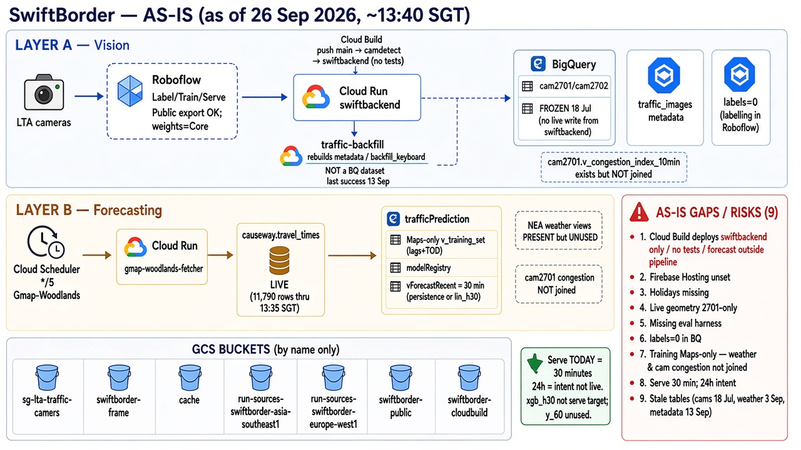
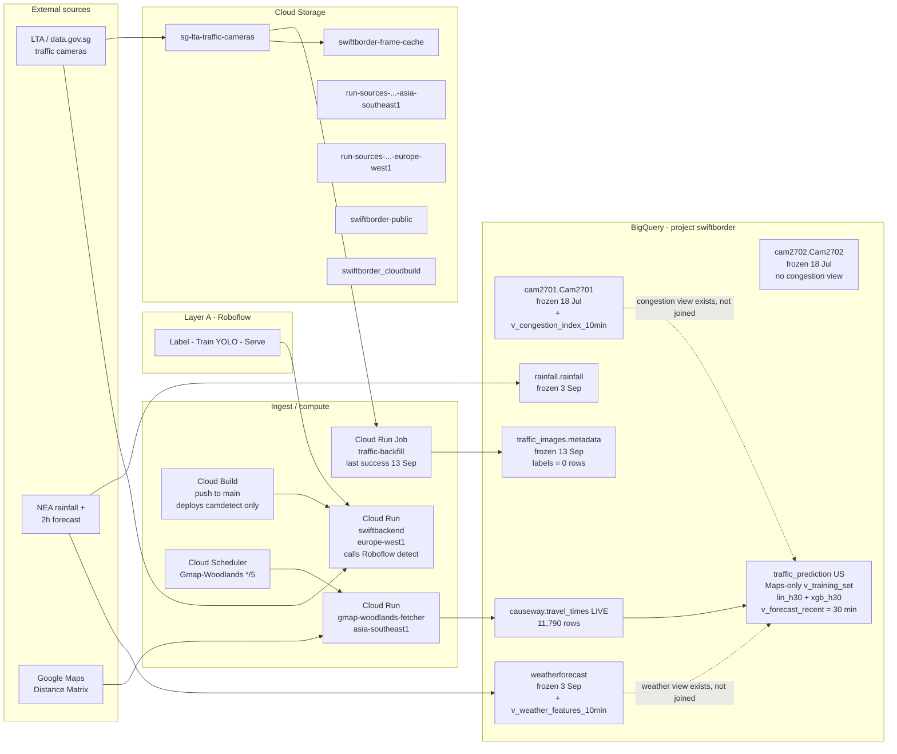
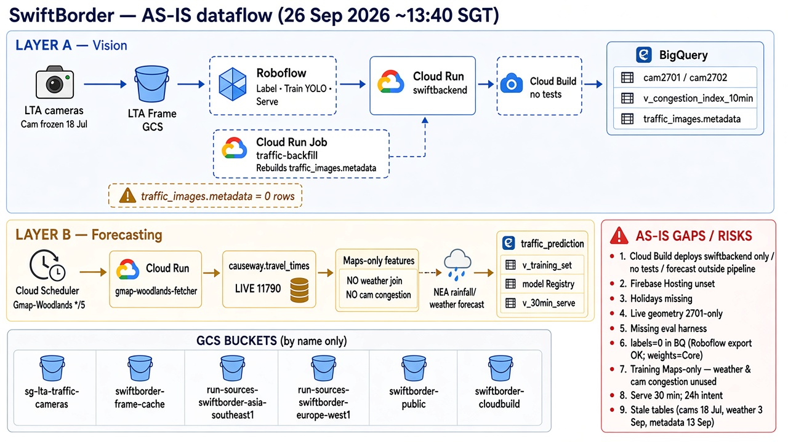

# SwiftBorder GCP architecture

**Project:** `swiftborder` (`1095552466513`)  
**As of:** 26 September 2026, ~13:40 SGT (read-only `bq` / `gcloud`)  
**Source of truth:** GCP project `swiftborder`. This page records that project as queried at the time above, plus in-repo code. Re-query before treating the diagram as current.

**Report section:** tools, techniques, and system design. The same system is drawn twice: a **high-level** view, then a **detailed** view. There is no as-is / to-be pair. Performance methods are in [evaluation.md](evaluation.md). Scope that is not in the project yet is in [findings.md](findings.md), not in a second architecture. The resource list is in [inventory.md](inventory.md).

## Techniques

The module asks the system to demonstrate at least three of these. Hybrid or ensemble is not demonstrated: `v_forecast_recent` selects `lin_h30` or persistence.

| Category | In this design |
| --- | --- |
| Supervised learning | Roboflow vehicle labels; BigQuery ML regression of later Maps duration (`y_30`, `y_60`) |
| Machine learning / deep learning | YOLO served through Roboflow; `lin_h30` (linear regression) and `xgb_h30` (boosted tree) |
| Intelligent sensing | LTA frame to directional occupancy. Dividing line in `camdetect` is camera 2701 only |
| Hybrid / ensemble | Not in the serve path. A blend would be an evaluation candidate, not a current component |

## Roboflow / YOLO free tier (verified 2026-09-26)

| Claim | Verified |
| --- | --- |
| "YOLO / Roboflow free does not allow label exports" | **Not accurate for dataset labels.** Roboflow Public allows dataset/annotation export after generating a version. |
| What Public *does* gate | **Manual model-weights download** is Core / paid. Credits can also block version generation (usual export path). |

Empty BigQuery `traffic_images.labels` means labelling lives in Roboflow, not that export is impossible on Public.

---

## High-level

Two layers. Layer A turns an LTA frame into directional occupancy through Roboflow. Layer B forecasts Maps `duration_in_traffic` from features of that series. Counts are not crossing time.

The file name is from an earlier as-is / to-be pass. Use this figure as the high-level drawing of the system in project `swiftborder`. Do not pair it with `architecture-proposal.png`.

## Detailed

`cam2701.v_congestion_index_10min` and `weatherforecast.v_weather_features_10min` are real views. `v_training_set` does not reference them. `swiftbackend` is the live detect HTTP service; the `Cam2701` / `Cam2702` tables have not been written since 18 Jul, so there is no current arrow from that service into those tables.

**Notes**

- `traffic-backfill` is a **Cloud Run Job** (compute), not a BigQuery dataset. Latest execution succeeded 13 Sep 2026, 03:53 SGT.
- `v_training_set` is built only from `causeway.travel_times`: 10-minute bins, lags, rolling means, time-of-day, weekend and peak flags. Labels are `y_30` and `y_60`.
- `v_forecast_recent` serves **30 minutes** ahead. It calls `ML.PREDICT` on `lin_h30` and picks `lin_h30` or persistence from `model_registry`. `y_60` is computed and not served. `xgb_h30` exists and is not the view's predict target.
- A 24-hour forecast is the product intent. It is not what the live view emits.

What those facts allow the report to claim is in [findings.md](findings.md). Methods and empty result tables are in [evaluation.md](evaluation.md).

The dataflow PNG's warning that `traffic_images.metadata` has 0 rows is wrong. Metadata has **368,905 rows** (last write 13 Sep 2026). The empty table is `traffic_images.labels`.

`architecture-proposal.png` and `dataflow-target.png` are leftover slides from an as-is / to-be pass. They are not report figures. Unfinished scope (joined features, a longer horizon, a harness, 2702 geometry, Firebase) is written in [findings.md](findings.md).
