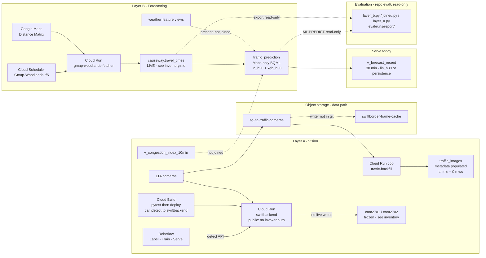
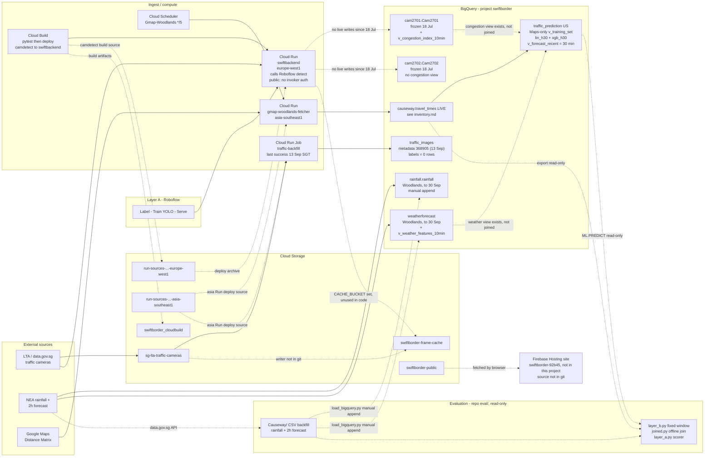

# SwiftBorder GCP architecture

**Project:** `swiftborder` (`1095552466513`)  
**Source of truth:** GCP project `swiftborder`. **Dated resource facts:** [inventory.md](inventory.md). This page describes system design plus in-repo code. Re-query the project before treating counts or serve paths as current.

**Report section:** tools, techniques, and system design. The same system is drawn twice: a **high-level** view, then a **detailed** view. There is no as-is / to-be pair. Performance methods are in [evaluation.md](evaluation.md). Scope that is not in the project yet is in [findings.md](findings.md), not in a second architecture. The resource list is in [inventory.md](inventory.md).

**Diagrams:** Mermaid in [diagrams/](diagrams/) is the **source of truth** for topology and joins. Each view below pairs that Mermaid with a deck PNG under [images/](images/). Edit the `.mmd` file, run `python docs/diagrams/sync_mermaid.py`, then refresh the PNG per [diagrams/README.md](diagrams/README.md).

## Techniques

The module asks the system to demonstrate at least three of these. All four are present; the ensemble is scored in evaluation but not served (`v_forecast_recent` selects `lin_h30` or persistence).

| Category | In this design |
| --- | --- |
| Supervised learning | Roboflow vehicle labels; BigQuery ML and offline regression of later Maps duration (`y_30`, 60-min offline) |
| Machine learning / deep learning | YOLO served through Roboflow; `lin_h30` (linear regression), `xgb_h30` (boosted tree), offline XGBoost; LSTM code exists but is unscored |
| Intelligent sensing | LTA frame to directional occupancy. Dividing line in `camdetect` is camera 2701 only |
| Hybrid / ensemble | Mean of `lin_h30` and `xgb_h30`, and ridge+XGBoost in the joined experiment, scored against the single models in [evaluation.md](evaluation.md). Not in the serve path |

## Roboflow / YOLO free tier

| Claim | Verified |
| --- | --- |
| "YOLO / Roboflow free does not allow label exports" | **Not accurate for dataset labels.** Roboflow Public allows dataset/annotation export after generating a version. |
| What Public *does* gate | **Manual model-weights download** is Core / paid. Credits can also block version generation (usual export path). |

Empty BigQuery `traffic_images.labels` means labelling lives in Roboflow, not that export is impossible on Public.

---

## High-level

Two layers. Layer A turns an LTA frame into directional occupancy through Roboflow. Layer B forecasts Maps `duration_in_traffic` from features of that series. Counts are not crossing time.

**Source:** [diagrams/architecture-high-level.mmd](diagrams/architecture-high-level.mmd)

<!-- mermaid:architecture-high-level -->

```mermaid
flowchart LR
  subgraph LA["Layer A - Vision"]
    LTA["LTA cameras"]
    ROB["Roboflow<br/>Label - Train - Serve"]
    GH["Cloud Build<br/>pytest then deploy<br/>camdetect to swiftbackend"]
    SB["Cloud Run<br/>swiftbackend<br/>public: no invoker auth"]
    JBF["Cloud Run Job<br/>traffic-backfill"]
    TI["traffic_images<br/>metadata populated<br/>labels = 0 rows"]
    C12["cam2701 / cam2702<br/>frozen - see inventory"]
    ROB -->|"detect API"| SB
    GH --> SB
    LTA --> SB
    JBF --> TI
    SB -.->|"no live writes"| C12
    VCI["v_congestion_index_10min"]
  end

  subgraph LB["Layer B - Forecasting"]
    SCH["Cloud Scheduler<br/>Gmap-Woodlands */5"]
    GFN["Cloud Run<br/>gmap-woodlands-fetcher"]
    TT["causeway.travel_times<br/>LIVE - see inventory.md"]
    LBTP["traffic_prediction<br/>Maps-only BQML<br/>lin_h30 + xgb_h30"]
    GMAP["Google Maps<br/>Distance Matrix"]
    SCH --> GFN
    GMAP --> GFN
    GFN --> TT
    TT --> LBTP
    WX["weather feature views"] -.->|"present, not joined"| LBTP
  end

  subgraph GCS["Object storage - data path"]
    CAM["sg-lta-traffic-cameras"]
    CACHE["swiftborder-frame-cache"]
  end

  subgraph SERVE["Serve today"]
    VF["v_forecast_recent<br/>30 min - lin_h30 or persistence"]
  end

  subgraph EVAL["Evaluation - repo eval/, read-only"]
    HAR["layer_b.py / joined.py / layer_a.py<br/>eval/runs/report/"]
  end

  LTA --> CAM
  CAM --> JBF
  CAM -.->|"writer not in git"| CACHE
  VCI -.->|"not joined"| LBTP
  LBTP --> VF
  LBTP -.->|"ML.PREDICT read-only"| HAR
  TT -.->|"export read-only"| HAR
```
<!-- /mermaid:architecture-high-level -->

**Deck export (regenerate from Mermaid when topology changes):**

This PNG predates the 2026-10-01 fact pass and is stale (see [diagrams/README.md](diagrams/README.md#png-exports-are-stale-regenerate-before-the-deck)); the Mermaid above is current. Do not pair these figures with a second "target" architecture figure.

The high-level Mermaid omits the four deploy/public buckets on purpose (grading focus is Layer A/B ML, not GCS topology). Camera ingest uses `sg-lta-traffic-cameras` and `swiftborder-frame-cache`; full bucket wiring is in the detailed diagram below.

## Detailed

**Source:** [diagrams/architecture-detailed.mmd](diagrams/architecture-detailed.mmd)

<!-- mermaid:architecture-detailed -->

```mermaid
flowchart LR
  subgraph Ext["External sources"]
    LTA["LTA / data.gov.sg<br/>traffic cameras"]
    NEA["NEA rainfall +<br/>2h forecast"]
    GMAP["Google Maps<br/>Distance Matrix"]
  end

  subgraph Ingest["Ingest / compute"]
    GH["Cloud Build<br/>pytest then deploy<br/>camdetect to swiftbackend"]
    SCH["Cloud Scheduler<br/>Gmap-Woodlands */5"]
    GFN["Cloud Run<br/>gmap-woodlands-fetcher<br/>asia-southeast1"]
    SB["Cloud Run<br/>swiftbackend<br/>europe-west1<br/>calls Roboflow detect<br/>public: no invoker auth"]
    BF["Cloud Run Job<br/>traffic-backfill<br/>last success 13 Sep SGT"]
  end

  subgraph RF["Layer A - Roboflow"]
    ROB["Label - Train YOLO - Serve"]
  end

  subgraph BQ["BigQuery - project swiftborder"]
    C1["cam2701.Cam2701<br/>frozen 18 Jul<br/>+ v_congestion_index_10min"]
    C2["cam2702.Cam2702<br/>frozen 18 Jul<br/>no congestion view"]
    TT["causeway.travel_times LIVE<br/>see inventory.md"]
    RF2["rainfall.rainfall<br/>Woodlands, to 30 Sep<br/>manual append"]
    WX["weatherforecast<br/>Woodlands, to 30 Sep<br/>+ v_weather_features_10min"]
    TI["traffic_images<br/>metadata 368905 (13 Sep)<br/>labels = 0 rows"]
    TP["traffic_prediction US<br/>Maps-only v_training_set<br/>lin_h30 + xgb_h30<br/>v_forecast_recent = 30 min"]
  end

  subgraph GCS["Cloud Storage"]
    CAM["sg-lta-traffic-cameras"]
    CACHE["swiftborder-frame-cache"]
    RS1["run-sources-...-asia-southeast1"]
    RS2["run-sources-...-europe-west1"]
    PUB["swiftborder-public"]
    CB["swiftborder_cloudbuild"]
  end

  LTA --> CAM
  LTA --> SB
  GH --> SB
  CAM --> BF
  BF --> TI
  ROB --> SB
  NEA --> RF2
  NEA --> WX
  SCH --> GFN
  GMAP --> GFN
  GFN --> TT
  TT --> TP
  C1 -.->|"congestion view exists, not joined"| TP
  WX -.->|"weather view exists, not joined"| TP
  SB -.->|"no live writes since 18 Jul"| C1
  SB -.->|"no live writes since 18 Jul"| C2
  CAM -.->|"writer not in git"| CACHE
  SB -.->|"CACHE_BUCKET set, unused in code"| CACHE

  GH -.->|"camdetect build source"| RS2
  RS2 -.->|"deploy archive"| SB
  GH -.->|"build artifacts"| CB
  RS1 -.->|"asia Run deploy source"| GFN
  RS1 -.->|"asia Run deploy source"| BF
  PUB -.->|"fetched by browser"| FH["Firebase Hosting site<br/>swiftborder-92b45, not in this project<br/>source not in git"]

  subgraph EV["Evaluation - repo eval/, read-only"]
    HAR["layer_b.py fixed window<br/>joined.py offline join<br/>layer_a.py scorer"]
    CSV["Causeway/ CSV backfill<br/>rainfall + 2h forecast"]
  end
  NEA -.->|"data.gov.sg API"| CSV
  CSV -.->|"load_bigquery.py manual append"| RF2
  CSV -.->|"load_bigquery.py manual append"| WX
  CSV -.-> HAR
  TP -.->|"ML.PREDICT read-only"| HAR
  TT -.->|"export read-only"| HAR
```
<!-- /mermaid:architecture-detailed -->

`cam2701.v_congestion_index_10min` and `weatherforecast.v_weather_features_10min` are real views. `v_training_set` does not reference them (dashed). `swiftbackend` is the live detect HTTP service; the `Cam2701` / `Cam2702` tables have not been written since 18 Jul, so its edges to them are dashed "no live writes". `swiftborder-frame-cache` has no writer in git; the service's `CACHE_BUCKET` env var is set but unused by `camdetect/main.py` (dashed). The `eval/` block is repo code that reads the project read-only; it writes nothing to GCP.

**Notes**

- `traffic-backfill` is a **Cloud Run Job** (compute), not a BigQuery dataset. Latest execution succeeded 13 Sep 2026, 03:53 SGT, after two failed runs the same day.
- `swiftbackend` is publicly invocable (IAM invoker check disabled, ingress `all`, CORS `*`) and holds `ROBOFLOW_API_KEY` as a plain env var. Recorded as a risk in [findings.md](findings.md); not changed.
- `v_training_set` is built only from `causeway.travel_times`: 10-minute bins, lags, rolling means, time-of-day, weekend and peak flags. Labels are `y_30` and `y_60`.
- `v_forecast_recent` serves **30 minutes** ahead. It calls `ML.PREDICT` on `lin_h30` and picks `lin_h30` or persistence from `model_registry`. `y_60` is computed and not served. `xgb_h30` exists and is not the view's predict target.
- View and BQML DDL checked in under [sql/](../sql/) (exported 2026-09-26). Apply order: [sql/README.md](../sql/README.md).
- A 24-hour forecast is the product intent. It is not what the live view emits.

What those facts allow the report to claim is in [findings.md](findings.md). Methods and scored results are in [evaluation.md](evaluation.md).

**Deck export (stale until regenerated; see [diagrams/README.md](diagrams/README.md#png-exports-are-stale-regenerate-before-the-deck)):**

Legacy proposal/target PNGs are not in the repo. Unfinished scope (camera features in the join, a longer horizon, Layer A results, 2702 geometry, the Hosting client in git) is in [findings.md](findings.md) and [roadmap.md](roadmap.md).
