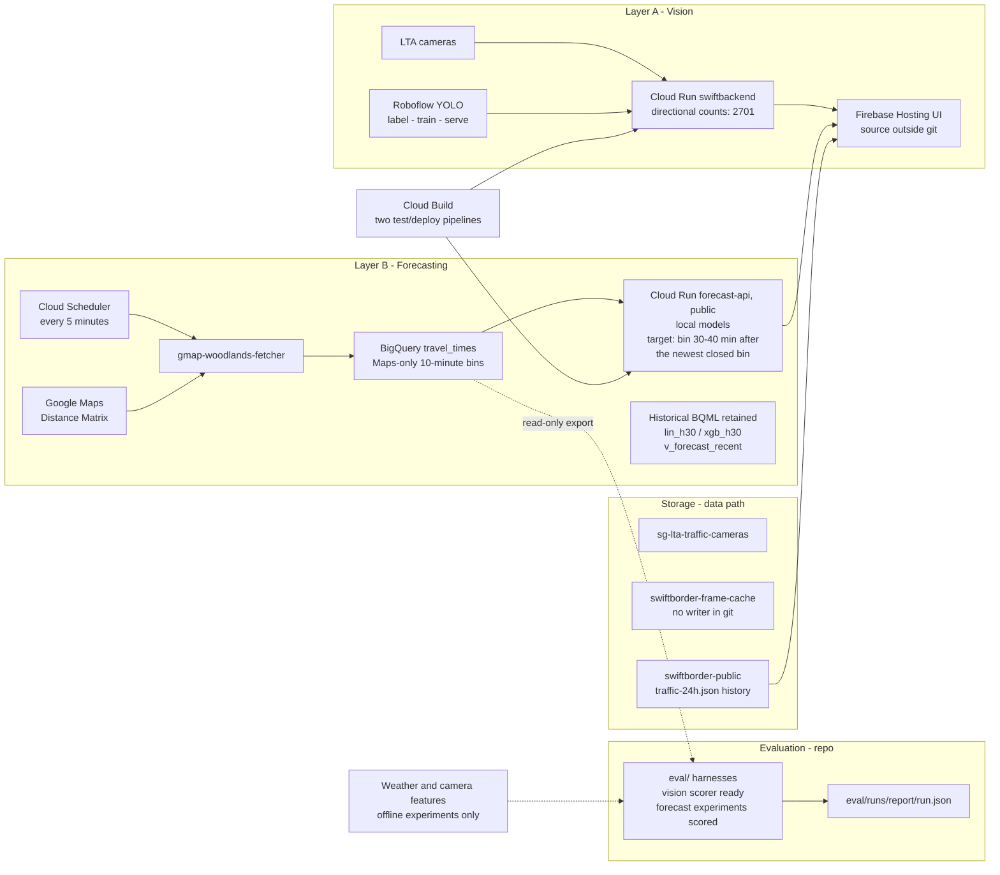
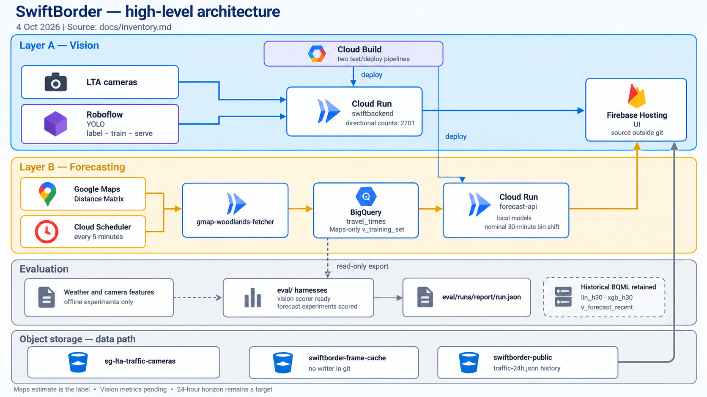
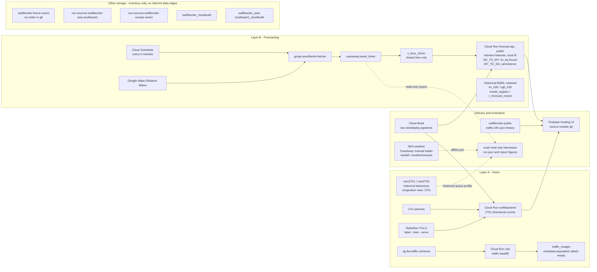
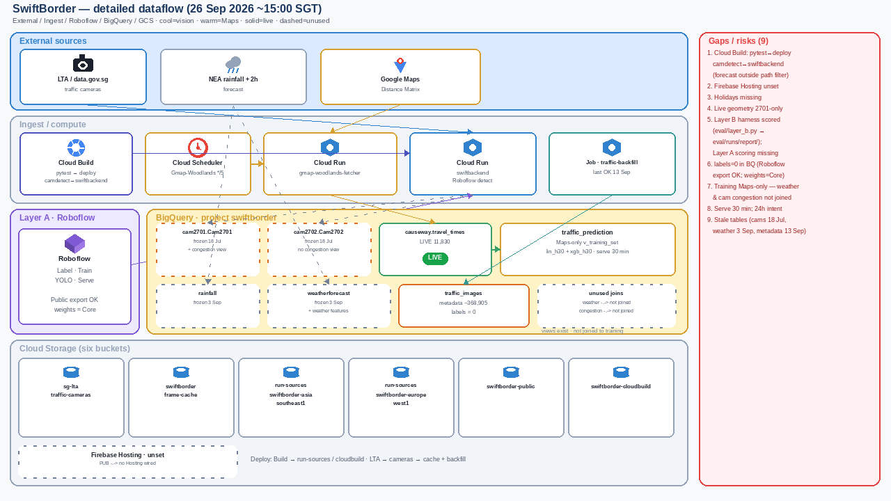

# SwiftBorder GCP architecture

**Project:** `swiftborder` (`1095552466513`)  
**Source of truth:** GCP project `swiftborder`. **Dated resource facts:** [inventory.md](inventory.md). This page describes system design plus in-repo code. Re-query the project before treating counts or serve paths as current.

**Report section:** tools, techniques, and system design. The same system is drawn twice: a **high-level** view, then a **detailed** view. There is no as-is / to-be pair. Performance methods are in [evaluation.md](evaluation.md). Scope that is not in the project yet is in [findings.md](findings.md), not in a second architecture. The resource list is in [inventory.md](inventory.md).

**Diagrams:** Mermaid in [diagrams/](diagrams/) is the **source of truth** for topology and joins. Each view below pairs that Mermaid with a deck PNG under [images/](images/). Edit the `.mmd` file, run `python docs/diagrams/sync_mermaid.py`, then refresh the PNG per [diagrams/README.md](diagrams/README.md).

## Techniques

The module asks the system to demonstrate at least three of these. All four are present; ensembles are scored offline. The live `forecast-api` serves local models, currently `lin_bq[frozen]` for SG_TO_MY and persistence for MY_TO_SG.

| Category | In this design |
| --- | --- |
| Supervised learning | Roboflow vehicle labels; BigQuery ML and offline regression of later Maps duration (`y_30`, 60-min offline) |
| Machine learning / deep learning | YOLO served through Roboflow; `lin_h30` (linear regression), `xgb_h30` (boosted tree), offline XGBoost; LSTM, GRU and a patch Transformer are scored offline |
| Intelligent sensing | LTA frame to directional occupancy. Dividing line in `camdetect` is camera 2701 only |
| Hybrid / ensemble | Mean of `lin_h30` and `xgb_h30`, and ridge+XGBoost in the joined experiment, scored against the single models in [evaluation.md](evaluation.md). Not in the serve path |

## Roboflow / YOLO free tier

| Claim | Verified |
| --- | --- |
| "YOLO / Roboflow free does not allow label exports" | **Not accurate for dataset labels.** Roboflow Public allows dataset/annotation export after generating a version. |
| What Public *does* gate | **Manual model-weights download** is Core / paid. Credits can also block version generation (usual export path). |

Empty BigQuery `traffic_images.labels` means labelling lives in Roboflow, not that export is impossible on Public.

---

## High-level

Two layers. Layer A turns an LTA frame into directional occupancy through Roboflow. Layer B forecasts Maps `duration_in_traffic` from features of that series. Counts are not crossing time.

**Source:** [diagrams/architecture-high-level.mmd](diagrams/architecture-high-level.mmd)

<!-- mermaid:architecture-high-level -->

```mermaid
flowchart LR
  subgraph LA["Layer A - Vision"]
    LTA["LTA cameras"] --> SB["Cloud Run swiftbackend<br/>directional counts: 2701"]
    RF["Roboflow YOLO<br/>label - train - serve"] --> SB
    SB --> UI["Firebase Hosting UI<br/>source outside git"]
  end
  subgraph LB["Layer B - Forecasting"]
    SCH["Cloud Scheduler<br/>every 5 minutes"] --> ING["gmap-woodlands-fetcher"]
    GM["Google Maps<br/>Distance Matrix"] --> ING
    ING --> TT["BigQuery travel_times<br/>Maps-only 10-minute bins"]
    TT --> API["Cloud Run forecast-api, public<br/>local models<br/>target: bin 30-40 min after<br/>the newest closed bin"]
    API --> UI
    OLD["Historical BQML retained<br/>lin_h30 / xgb_h30<br/>v_forecast_recent"]
  end
  BUILD["Cloud Build<br/>two test/deploy pipelines"] --> SB
  BUILD --> API
  subgraph GCS["Storage - data path"]
    CAM["sg-lta-traffic-cameras"]
    CACHE["swiftborder-frame-cache<br/>no writer in git"]
    PUB["swiftborder-public<br/>traffic-24h.json history"] --> UI
  end
  subgraph EV["Evaluation - repo"]
    HAR["eval/ harnesses<br/>vision scorer ready<br/>forecast experiments scored"] --> REP["eval/runs/report/run.json"]
  end
  TT -.->|"read-only export"| HAR
  UNUSED["Weather and camera features<br/>offline experiments only"] -.-> HAR
```
<!-- /mermaid:architecture-high-level -->

**Deck export (regenerate from Mermaid when topology changes):**

Regenerated on 4 Oct 2026 after a fresh serving and storage check; see [diagrams/README.md](diagrams/README.md). **Stale since then:** the `forecast-api` input is now `v_bins_10min` (closed bins, harness features), not `v_training_set`, and the service is labelled public. The Mermaid above already shows this. Regenerate both PNGs before the deck.

The high-level figure shows camera, cache and public-history storage. The detailed figure names all seven verified buckets. Storage inventory nodes have no inferred data-flow edges.

## Detailed

**Source:** [diagrams/architecture-detailed.mmd](diagrams/architecture-detailed.mmd)

<!-- mermaid:architecture-detailed -->

```mermaid
flowchart LR
  subgraph LA["Layer A - Vision"]
    LTA["LTA cameras"] --> SB["Cloud Run swiftbackend<br/>2701 directional counts"]
    RF["Roboflow YOLO<br/>label - train - serve"] --> SB
    CAM["sg-lta-traffic-cameras"] --> JOB["Cloud Run Job<br/>traffic-backfill"]
    JOB --> META["traffic_images<br/>metadata populated; labels empty"]
    HIST["cam2701 / cam2702<br/>historical detections<br/>congestion view: 2701"]
  end
  subgraph LB["Layer B - Forecasting"]
    SCH["Cloud Scheduler<br/>every 5 minutes"] --> ING["gmap-woodlands-fetcher"]
    MAPS["Google Maps Distance Matrix"] --> ING
    ING --> TT["causeway.travel_times"]
    TT --> FEATURES["v_bins_10min<br/>closed bins only"]
    FEATURES --> API["Cloud Run forecast-api, public<br/>harness features, local fit<br/>SG_TO_MY: lin_bq frozen<br/>MY_TO_SG: persistence"]
    LEGACY["Historical BQML retained<br/>lin_h30 / xgb_h30<br/>model_registry / v_forecast_recent"]
  end
  subgraph DELIVERY["Delivery and evaluation"]
    BUILD["Cloud Build<br/>two test/deploy pipelines"] --> SB
    BUILD --> API
    UI["Firebase Hosting UI<br/>source outside git"]
    SB --> UI
    API --> UI
    PUB["swiftborder-public<br/>traffic-24h.json history"] --> UI
    EVAL["eval/ read-only harnesses<br/>run.json and report figures"]
    WX["NEA weather<br/>Causeway manual loader<br/>rainfall / weatherforecast"] -.->|"offline join"| EVAL
    HIST -.->|"historical queue profile"| EVAL
    TT -.->|"read-only export"| EVAL
  end
  subgraph STORAGE["Other storage - inventory only, no inferred data edges"]
    CACHE["swiftborder-frame-cache<br/>no writer in git"]
    RS1["run-sources-swiftborder-asia-southeast1"]
    RS2["run-sources-swiftborder-europe-west1"]
    CB["swiftborder_cloudbuild"]
    CBA["swiftborder_asia-southeast1_cloudbuild"]
  end
```
<!-- /mermaid:architecture-detailed -->

Weather and historical camera features are used only in offline experiments. The live `v_training_set` and `forecast-api` inputs are Maps-only. The `eval/` block reads the project without writing to GCP; its dashed inputs denote offline work. `swiftborder-frame-cache` has no writer in git. Deployment and offline-input references are repeated as labelled references in the detailed PNG to avoid crossing connectors.

**Notes**

- `traffic-backfill` is a **Cloud Run Job** (compute), not a BigQuery dataset. Latest execution succeeded 13 Sep 2026, 03:53 SGT, after two failed runs the same day.
- `swiftbackend` is publicly invocable (IAM invoker check disabled, ingress `all`, CORS `*`) and holds `ROBOFLOW_API_KEY` as a plain env var. Recorded as a risk in [findings.md](findings.md); not changed.
- `v_training_set` is built only from `causeway.travel_times`: 10-minute bins, lags, rolling means, time-of-day, weekend and peak flags. Labels are `y_30` and `y_60`.
- `forecast-api` reads closed `v_bins_10min` bins and builds the features with the harness's time-based rules (`local_models.features_from_bins`), then fits and serves local models. The target is the mean over the bin 30-40 minutes after the newest closed bin, which is 9-19 minutes ahead of the request when ingestion is current (`lead_min`). A direction with stale data answers 503. The service is public (invoker IAM check disabled, by decision). `v_forecast_recent`, `lin_h30`, `xgb_h30` and the BQML registry remain as historical resources; the HTTP API does not call them.
- View and BQML DDL checked in under [sql/](../sql/) (exported 2026-09-26). Apply order: [sql/README.md](../sql/README.md).
- A 24-hour forecast is the product intent. It is not what the live API emits.

What those facts allow the report to claim is in [findings.md](findings.md). Methods and scored results are in [evaluation.md](evaluation.md).

**Deck export (regenerated 4 Oct 2026):**

Legacy proposal/target PNGs are not in the repo. Unfinished scope (camera features in the join, a longer horizon, Layer A results, 2702 geometry, the Hosting client in git) is in [findings.md](findings.md) and [roadmap.md](roadmap.md).
