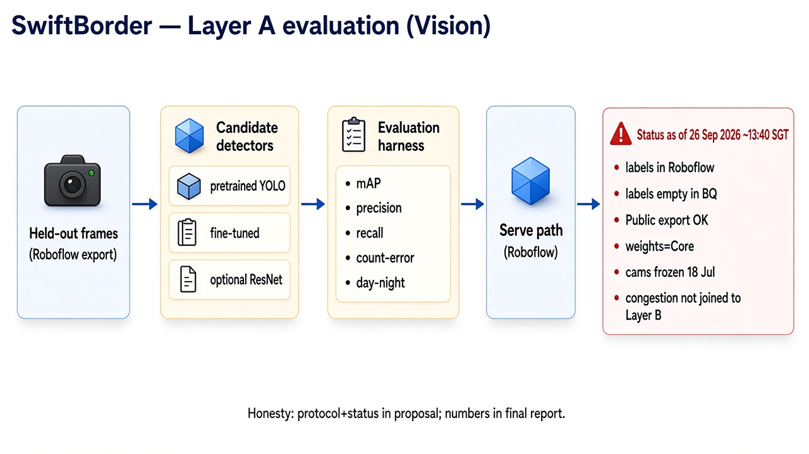
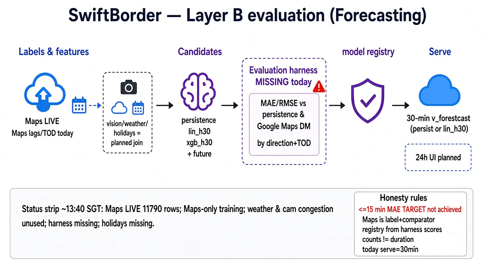

# Evaluation and reasoning

**Report section:** performance (methods now; numbers when a harness writes them)  
**Source of truth for live resources:** GCP project `swiftborder`  
**Live resources:** [inventory.md](inventory.md). **Rubric:** methods and metrics are graded. This file is the methods chapter. Result cells stay `pending` until a harness run is recorded here. Claims that depend on those cells belong in the final report, not in the proposal.

Diagrams: [images/eval-layer-a.png](images/eval-layer-a.png), [images/eval-layer-b.png](images/eval-layer-b.png).

---

## What would count as success

The product intent is a Woodlands-only forecast of causeway crossing time, up to 24 hours ahead, with mean absolute error at or below 15 minutes.

The live serve path is narrower than the product sentence. `v_forecast_recent` emits a **30-minute** forecast of Google Maps `duration_in_traffic`. Training features are lags and time-of-day from that same series. Layer A counts vehicles in a camera frame. Those counts are occupancy, not crossing time.

<= 15 min MAE and the 24-hour horizon stay **targets**.

---

## Reasoning

### The series is Maps' current estimate

`causeway.travel_times.duration_in_traffic_sec` is the Distance Matrix estimate at observation time. There is no second ground truth in the project (no probe-vehicle wait, no checkpoint timestamp). Every Layer B score is skill **on the Maps series**.

`v_training_set` defines:

- `y_persistence` as duration in the current 10-minute bin
- `y_30` and `y_60` as the duration 3 and 6 bins later (`LEAD`)

A model beats persistence when its error on a **future** Maps reading is lower than carrying the current reading forward. That is a real forecast test.

It is not, by itself, "we beat Google." Maps is the label generator. The project does not store a separate Google forecast at a 30-minute or 24-hour horizon. Wording for the report: **skill over persistence on the Maps duration series**. Reserve "beat Google" for a comparison against an independent wait measurement, which this dataset does not contain.

### Layer A cannot carry the product metric

A strong detector can still leave Layer B wrong, because a queue visible in one frame is not the time to cross. Camera refresh is about once a minute, so a frame cannot be turned into a flow count. Layer A is graded on detection quality (mAP, precision, recall, count-error, day versus night). Layer B is graded on duration error. The report should keep those tables separate.

### Weather and congestion are hypotheses, not current inputs

`v_weather_features_10min` and `cam2701.v_congestion_index_10min` exist. `v_training_set` does not reference them. The protocol includes them because the proposal's claim is a multi-source forecast. Until they are joined, a results table that credits rain or queue depth is unsupported. The honest current feature set is Maps lags, rolling means, and time-of-day.

### Why these baselines

| Comparison | Why it is in the protocol |
| --- | --- |
| Persistence (`y_t` predicts `y_{t+h}`) | Naive forecast. Required in every Layer B table. |
| `lin_h30` (linear regression) | The model `v_forecast_recent` actually calls. |
| `xgb_h30` (boosted tree) | Trained on 12 Sep and not called by the serve view. The harness decides whether it earns the registry row. |
| Day / night, direction, time-of-day | The border is not one regime. A single MAE can hide a peak-hour failure. |

`model_registry` has two rows (see [model_registry_reference.sql](../sql/bigquery/traffic_prediction/model_registry_reference.sql)). Training features and OPTIONS for `lin_h30` / `xgb_h30` are in [sql/bigquery/traffic_prediction/](../sql/bigquery/traffic_prediction/). The report should fill registry rows from harness scores (direction, serving model, reason, test window, date), not from preference alone.

---

## Techniques this evaluation is accountable for

The module asks for at least three of the categories below. Hybrid or ensemble is available as a fourth once the harness compares a blend. The serve view today selects `lin_h30` or persistence, so a blend is not yet demonstrated.

| Category | Where it shows up | What the harness must report |
| --- | --- | --- |
| Supervised learning | Roboflow labels; regression of future Maps duration | Hold-out detection metrics; time-based hold-out for `y_30` / `y_60` |
| Machine learning / deep learning | YOLO via Roboflow; BigQuery ML `lin_h30` and `xgb_h30` | Same hold-outs, one row per candidate |
| Intelligent sensing | LTA frames to directional occupancy (camera 2701 geometry in `camdetect`) | Count-error and day/night, not crossing time |
| Hybrid / ensemble | Not in the serve path | Only if a blend is scored against the single models |

---

## Layer A — vision

**Question:** On held-out frames, how well does a detector localize vehicles and recover directional counts?

**Candidates:** pretrained baseline, fine-tuned YOLO, optional ResNet. Same hold-out for all three.

**Procedure:**

1. Export a Roboflow dataset version and hold out frames. Do not train on that hold-out.
2. Score each candidate.
3. Report the metrics below, split by day and night.
4. Record scores before promoting a serving checkpoint. Roboflow remains the serve path. Public plan: dataset export after a version is allowed; manual weight download is Core.

**Status:** labels are in Roboflow. `traffic_images.labels` has 0 rows. `traffic_images.metadata` is populated and is not a label table. There is **no** checked-in Layer A scoring script; only the protocol and table below.

### Results table (fill from the harness)

| Candidate | Split | mAP | Precision | Recall | Count-error | Day | Night |
| --- | --- | --- | --- | --- | --- | --- | --- |
| Pretrained | hold-out | pending | pending | pending | pending | pending | pending |
| Fine-tuned YOLO | hold-out | pending | pending | pending | pending | pending | pending |
| ResNet (optional) | hold-out | pending | pending | pending | pending | pending | pending |

---

## Layer B — crossing-time forecast

**Question:** On a later window of the Maps series, how far is each forecast from the observed duration, compared with persistence?

**Procedure:**

1. Build 10-minute bins from `causeway.travel_times` (`status = OK`). Add weather and congestion only after those views are joined. Add holiday flags only after a calendar exists.
2. Fit candidates on an earlier window. Always include persistence. Include `lin_h30` and `xgb_h30`.
3. Score MAE and RMSE on the held-out window, by direction (`SG_TO_MY`, `MY_TO_SG`) and by time-of-day (morning peak, evening peak, other).
4. Write the chosen serving model to `model_registry` with reason, test window, and date.
5. Leave <= 15 min MAE as a target until a cell in the table supports it.

**Status:** see [inventory.md](inventory.md) for live row counts and serve path. Features in `v_training_set` are Maps-only. `v_forecast_recent` serves 30 minutes (`lin_h30` or persistence). `y_60` is computed and not served. `xgb_h30` is not called by that view. A read-only harness lives in [`eval/layer_b.py`](../eval/layer_b.py); the table below stays `pending` until you run it and paste numbers in a follow-up commit.

### How to run the Layer B harness

From [`eval/README.md`](../eval/README.md): install `eval/requirements.txt`, run `python layer_b.py` from `eval/` (read-only BigQuery). Run `python -m pytest` in `eval/` first for offline checks. Do not write `model_registry` unless a future flag implements it. Wording for the report: **skill against persistence on the Maps series.**

### Results table (fill from the harness)

| Candidate | Horizon | Test window | MAE (min) | RMSE (min) | Persistence MAE | Direction | Time of day |
| --- | --- | --- | --- | --- | --- | --- | --- |
| Persistence | 30 min | pending | pending | pending | — | both | all |
| `lin_h30` | 30 min | pending | pending | pending | pending | both | all |
| `xgb_h30` | 30 min | pending | pending | pending | pending | both | all |
| Joined model (weather + congestion) | 30 min | pending | pending | pending | pending | both | all |
| Any 60 min or 24 h model | 60 min / 24 h | pending | pending | pending | pending | both | all |

Slice rows (direction, morning peak, evening peak, night) are added beside the aggregate row. A model is not "the" model until the registry row cites this table.

---

## Principal risk

**Counts are not crossing duration.** Report Layer A and Layer B separately. A low count-error does not imply a low MAE.

**The label is not an independent clock.** Report skill against persistence on the Maps series. Do not write "we beat Google" from that comparison alone.
