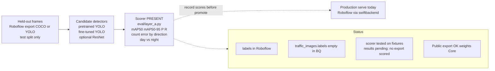
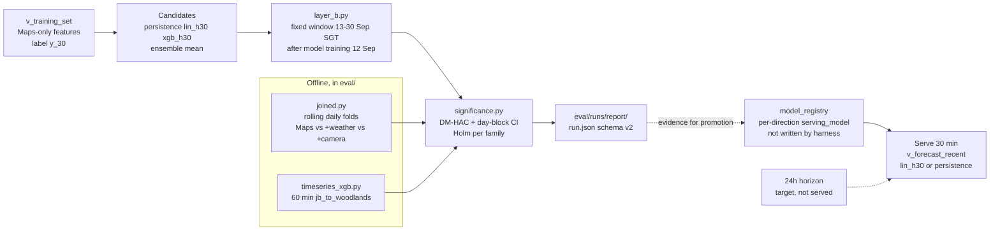

# Evaluation and reasoning

**Report section:** performance (methods, reasoning, scored results).
**Source of truth for live resources:** GCP project `swiftborder` ([inventory.md](inventory.md)).
**Source of every number on this page:** [`eval/runs/report/run.json`](../eval/runs/report/run.json), run `20260930T172339Z_offline-bqml-joined` (schema v2). That run was made from uncommitted code and promoted with `--allow-dirty`. Its `provenance.code_sha256` (`e735477a…`) matched the working tree at promotion; promotion refuses a run whose hash differs. Re-run and re-promote after the code is committed. Cells marked `pending` have no harness output yet.

Protocol diagrams: [diagrams/eval-layer-a.mmd](diagrams/eval-layer-a.mmd), [diagrams/eval-layer-b.mmd](diagrams/eval-layer-b.mmd) (embedded below). The deck PNGs `images/eval-layer-a.png` and `images/eval-layer-b.png` are stale until regenerated ([diagrams/README.md](diagrams/README.md)).

---

## What would count as success

The product intent is a Woodlands-only forecast of causeway crossing time, up to 24 hours ahead, with mean absolute error at or below 15 minutes. **Both stay targets.** The live serve path emits a **30-minute** forecast of Google Maps `duration_in_traffic` (`v_forecast_recent`). No model here forecasts beyond 60 minutes, and there is no independent crossing-time label to test the 15-minute target against.

---

## Reasoning

### The label is Maps' current estimate

`causeway.travel_times.duration_in_traffic_sec` is the Distance Matrix estimate at observation time. There is no second ground truth (no probe-vehicle wait, no checkpoint timestamp). Every Layer B score is skill **on the Maps series**: a model beats persistence when its error on a future Maps reading is lower than carrying the current reading forward. Say "skill over persistence on the Maps duration series", not "we beat Google".

`v_training_set` defines `y_persistence` as the mean duration in the current 10-minute bin and `y_30` / `y_60` as the bin 3 / 6 bins later. The bin mean includes readings up to the bin end, so a row is treated as known at bin start + 10 minutes.

### Baselines

| Baseline | Why |
| --- | --- |
| Persistence (`y_t` predicts `y_{t+h}`) | Naive forecast; required in every Layer B table |
| **Maps typical** (`duration_sec` at the origin: Google's duration without traffic) | The "vs Maps" comparator the project can actually score. It is a weak baseline (no traffic), included so the report does not only compare against itself |
| `lin_h30` | The model `v_forecast_recent` calls |
| `xgb_h30` | Trained, not served |
| Ensemble | Mean of two models; tests the hybrid/ensemble category |

### Layer A cannot carry the product metric

A strong detector can still leave Layer B wrong, because a queue visible in one frame is not the time to cross. Layer A is scored on detection (mAP, precision, recall, count error, day versus night). Layer B is scored on duration error. Keep the tables separate.

### Significance

Point forecasts are **paired** on the same `(direction, time)` rows. For each row, `d_i = |y_i - ŷ_i^challenger| - |y_i - ŷ_i^reference|` in minutes (negative: challenger better). Code: [`eval/significance.py`](../eval/significance.py).

| Method | Role |
| --- | --- |
| **Diebold–Mariano** on `d_i`, Newey–West (Bartlett) variance, Harvey–Leybourne–Newbold small-sample correction, Student-t(n−1) | Primary test, two-sided. HAC lag = the larger of h−1, ⌊4(n/100)^(2/9)⌋ and one day of samples (capped at n/3), because traffic loss differentials stay correlated for about a day; autocovariances stay within a direction |
| **Moving-block bootstrap** CI for mean(`d`) | Overlapping blocks of one calendar day of samples, drawn within each direction (never across) |
| **Holm** correction | Two-sided DM p-values, one family per harness family: family-wise error of any directional claim ≤ α = 0.05 |
| Paired t-test | Supplementary only (assumes independent errors; reported, not used for decisions) |

**Decision rule:** "challenger" only when the Holm-adjusted two-sided DM p < 0.05, the mean difference is negative, **and** the two-sided 95% bootstrap CI lies entirely below 0; "reference" by the mirror rule; **"insufficient data"** when a resample has fewer than 10 day-blocks (the CI is too coarse); otherwise "not significant". Very small p-values are reported as computed but should be read as "far below α", not as precise probabilities.

References: Diebold & Mariano (1995), *J. Bus. Econ. Stat.* 13(3); Harvey, Leybourne & Newbold (1997), *Int. J. Forecasting* 13(2); Newey & West (1987), *Econometrica* 55(3); Künsch (1989), *Ann. Statist.* 17(3); Holm (1979), *Scand. J. Statist.* 6(2).

### Techniques this evaluation is accountable for

| Category | Where it shows up | Scored here |
| --- | --- | --- |
| Supervised learning | Roboflow labels; regression of future Maps duration | Layer B tables below; Layer A pending |
| Machine learning / deep learning | YOLO via Roboflow; BQML `lin_h30`, `xgb_h30`; offline XGBoost and ridge | Layer B tables below |
| Intelligent sensing | LTA frames to directional occupancy (camera 2701 line in `camdetect`) | Layer A scorer ready; results pending |
| Hybrid / ensemble | `ensemble_mean` of `lin_h30` + `xgb_h30`; ridge + XGBoost in the joined experiment | Layer B tables below |
| Deep learning (LSTM) | [`eval/timeseries_lstm.py`](../eval/timeseries_lstm.py), same rows as offline XGB | Code and tests only; **not scored** in `report/` |

---

## Layer A — vision

**Question:** on held-out frames, how well does a detector localise vehicles and recover directional counts?

**Procedure:** export a Roboflow dataset version (Public allows dataset export; weight download is Core), hold out the `test` split, and score each candidate with [`eval/layer_a.py`](../eval/layer_a.py): mAP@0.5, mAP@0.5:0.95 (101-point, class-aware), precision and recall at confidence 0.1, count error overall and per direction using the 2701 dividing line, split day (07:00–18:59 SGT) versus night. The scorer is tested on hand-computed fixtures (`eval/tests/test_layer_a.py`).

**Status:** labels live in Roboflow; `traffic_images.labels` has 0 rows; `traffic_images.metadata` is populated and is not a label table. **No export has been scored.**

<!-- mermaid:eval-layer-a -->

```mermaid
flowchart LR
  EXP["Held-out frames<br/>Roboflow export COCO or YOLO<br/>test split only"]
  CAND["Candidate detectors<br/>pretrained YOLO<br/>fine-tuned YOLO<br/>optional ResNet"]
  HARNESS["Scorer PRESENT<br/>eval/layer_a.py<br/>mAP50 mAP50-95 P R<br/>count error by direction<br/>day vs night"]
  SERVE["Production serve today<br/>Roboflow via swiftbackend"]
  EXP --> CAND --> HARNESS
  HARNESS -.->|"record scores before promote"| SERVE

  subgraph STATUS["Status"]
    S1["labels in Roboflow"]
    S2["traffic_images.labels empty in BQ"]
    S3["scorer tested on fixtures<br/>results pending: no export scored"]
    S4["Public export OK weights Core"]
  end

  HARNESS -.-> STATUS
```
<!-- /mermaid:eval-layer-a -->

### Results table

| Candidate | Split | mAP@0.5 | mAP@0.5:0.95 | Precision | Recall | Count MAE | Day | Night |
| --- | --- | --- | --- | --- | --- | --- | --- | --- |
| Pretrained | test | pending | pending | pending | pending | pending | pending | pending |
| Fine-tuned YOLO (served) | test | pending | pending | pending | pending | pending | pending | pending |
| ResNet (optional) | test | pending | pending | pending | pending | pending | pending | pending |

---

## Layer B — crossing-time forecast

<!-- mermaid:eval-layer-b -->

```mermaid
flowchart LR
  DATA["v_training_set<br/>Maps-only features<br/>label y_30"]
  CAND["Candidates<br/>persistence lin_h30 xgb_h30<br/>ensemble mean"]
  HAR["layer_b.py<br/>fixed window 13-30 Sep SGT<br/>after model training 12 Sep"]
  SIG["significance.py<br/>DM-HAC + day-block CI<br/>Holm per family"]
  REP["eval/runs/report/<br/>run.json schema v2"]
  REG["model_registry<br/>per-direction serving_model<br/>not written by harness"]
  SRV["Serve 30 min<br/>v_forecast_recent<br/>lin_h30 or persistence"]
  DATA --> CAND --> HAR --> SIG --> REP
  REG --> SRV
  REP -.->|"evidence for promotion"| REG

  subgraph OFF["Offline, in eval/"]
    JX["joined.py<br/>rolling daily folds<br/>Maps vs +weather vs +camera"]
    OX["timeseries_xgb.py<br/>60 min jb_to_woodlands"]
  end
  JX --> SIG
  OX --> SIG
  INTENT["24h horizon<br/>target, not served"] -.-> SRV
```
<!-- /mermaid:eval-layer-b -->

### 1. Production models, 30 minutes (`eval/layer_b.py`)

**Window:** 2026-09-13 00:00 to 2026-09-30 23:50 SGT (forecast origin), both directions. `lin_h30` and `xgb_h30` were trained once on 2026-09-12 (06:15 / 06:19 UTC) with a CUSTOM split on 11–12 Sep; the harness asserts training precedes the window, so every scored row is out-of-sample. **Rows:** 5,184 (2,592 per direction), filtered to `after_gap = 0` and an exact +30-minute label (0 rows excluded). Read-only BigQuery.

| Candidate | Direction | n | MAE (min) | RMSE (min) |
| --- | --- | --- | --- | --- |
| Persistence | both | 5,184 | 2.640 | 3.894 |
| `lin_h30` | both | 5,184 | 2.777 | 3.777 |
| `xgb_h30` | both | 5,184 | 2.493 | 3.678 |
| Ensemble (mean of both) | both | 5,184 | 2.459 | 3.526 |
| Persistence | SG_TO_MY | 2,592 | 2.777 | 4.046 |
| `lin_h30` | SG_TO_MY | 2,592 | 2.580 | 3.674 |
| `xgb_h30` | SG_TO_MY | 2,592 | 2.653 | 3.883 |
| Ensemble | SG_TO_MY | 2,592 | 2.468 | 3.611 |
| Persistence | MY_TO_SG | 2,592 | 2.504 | 3.736 |
| `lin_h30` | MY_TO_SG | 2,592 | 2.974 | 3.877 |
| `xgb_h30` | MY_TO_SG | 2,592 | 2.333 | 3.461 |
| Ensemble | MY_TO_SG | 2,592 | 2.450 | 3.440 |

**Headline significance** (Holm over these 11 comparisons; mean AE difference in minutes, 95% day-block CI):

| Challenger | Reference | Direction | Mean diff | CI | Decision |
| --- | --- | --- | --- | --- | --- |
| `lin_h30` | Persistence | both | +0.136 | [+0.026, +0.259] | not significant (Holm p = 0.33) |
| `xgb_h30` | Persistence | both | −0.147 | [−0.233, −0.061] | challenger |
| Ensemble | Persistence | both | −0.182 | [−0.253, −0.095] | challenger |
| `lin_h30` | Persistence | SG_TO_MY | −0.198 | [−0.337, −0.076] | challenger |
| `xgb_h30` | Persistence | SG_TO_MY | −0.124 | [−0.268, +0.005] | not significant |
| Ensemble | Persistence | SG_TO_MY | −0.309 | [−0.414, −0.225] | challenger |
| `lin_h30` | Persistence | MY_TO_SG | +0.471 | [+0.310, +0.706] | reference (`lin_h30` worse) |
| `xgb_h30` | Persistence | MY_TO_SG | −0.170 | [−0.258, −0.052] | challenger |
| Ensemble | Persistence | MY_TO_SG | −0.054 | [−0.155, +0.111] | not significant |
| Ensemble | `lin_h30` | both | −0.318 | [−0.378, −0.255] | challenger |
| Ensemble | `xgb_h30` | both | −0.034 | [−0.109, +0.049] | not significant |

**Slices** (a second Holm family of 63 comparisons, exploratory): `lin_h30` is significantly worse than persistence on `MY_TO_SG` in morning peak (+0.93), evening peak (+0.79), on weekdays and in daytime; `xgb_h30` is significantly better there in morning peak (−0.29), off-peak and on weekdays. On `SG_TO_MY`, `lin_h30` is significantly better in morning peak (−0.38), on weekdays and at night. Weekend slices have only 5 day-blocks per direction and are "insufficient data". The full table is in `run.json` (`bqml.significance`, `family = slices`).

**What this supports:** the live registry choice (`SG_TO_MY` → `lin_h30`, `MY_TO_SG` → persistence) beats or matches persistence in each direction on this window. `xgb_h30` would improve `MY_TO_SG` over the served persistence, and the ensemble improves `SG_TO_MY` over persistence; neither is served. Registry changes are a separate, approved write.

Plots: `eval/runs/report/bqml/mae-by-direction.png`, `bqml/mae-diff-ci.png` (forest plot coloured by decision).

### 2. Joined features, 30 minutes (`eval/joined.py`)

**Question:** do rainfall, the 2-hour forecast, or camera-2701 queue depth reduce 30-minute MAE beyond Maps-only features?

**Data:** Maps bins rebuilt in pandas from a `travel_times` export by [`eval/features.py`](../eval/features.py). The run compared them with the live `v_training_set` on 7,172 rows (through 2026-09-30 15:20 UTC): every compared column matched, largest difference 1.4e-14 (`joined.dataset.parity_with_live_v_training_set`). Rainfall at station S210 (Woodlands Centre) and the Woodlands 2-hour forecast were fetched from data.gov.sg for 5–30 Sep ([`Causeway/`](../Causeway/README.md)). Every feature uses data available at or before the forecast origin: rainfall readings stamped at or before it, and the forecast most recently **acquired by data.gov.sg** (`update_timestamp`) whose valid period covers the target time. At run time the BigQuery weather tables ended on 31 Aug SGT and the camera tables on 18 Jul, so the experiment reads the CSVs directly (the same Woodlands rows were later appended to BigQuery; see [inventory.md](inventory.md)). The camera row is pending the backfill in [handoff-camera-pilot.md](handoff-camera-pilot.md).

**Design:** rolling-origin daily folds, test days 13–30 Sep SGT (18 folds, 5,184 rows, same window as section 1). Each fold trains on rows whose label was observed before the test day. Models: ridge (median imputation + missing indicators) and XGBoost (seed 42); ensemble = their mean.

| Candidate | Features | MAE (min) | RMSE (min) |
| --- | --- | --- | --- |
| Persistence | — | 2.640 | 3.894 |
| Maps typical | — | 12.816 | 15.650 |
| Ridge | Maps | 2.500 | 3.553 |
| XGBoost | Maps | 2.275 | 3.311 |
| Ensemble | Maps | 2.306 | 3.324 |
| Ridge | Maps + weather | 2.511 | 3.573 |
| XGBoost | Maps + weather | 2.277 | 3.314 |
| Ensemble | Maps + weather | 2.313 | 3.337 |
| any | Maps + weather + camera | pending | pending |

Significance (Holm over 15 comparisons, both directions):

| Challenger | Reference | Mean diff (both) | CI | Decision |
| --- | --- | --- | --- | --- |
| XGBoost [Maps] | Persistence | −0.366 | [−0.486, −0.246] | challenger (also in each direction) |
| XGBoost [Maps] | Maps typical | −10.54 | [−11.52, −9.62] | challenger |
| XGBoost [Maps + weather] | XGBoost [Maps] | +0.003 | [−0.015, +0.022] | not significant |
| Ridge [Maps + weather] | Ridge [Maps] | +0.011 | [−0.002, +0.025] | not significant |
| Ensemble [Maps + weather] | XGBoost [Maps + weather] | +0.036 | [−0.003, +0.075] | not significant (also on `MY_TO_SG`: +0.076, Holm p = 0.064) |

**Finding:** on 13–30 Sep, weather features did **not** reduce 30-minute MAE (difference indistinguishable from zero for both models, and slightly positive). An XGBoost refit daily on Maps-only features beats persistence by about 0.37 min. The camera experiment is pending: no camera-2701 frames have been scored for this window yet (0% coverage; see the camera backfill in [plan-eval-integrity.md](plan-eval-integrity.md)). A camera row will be marked insufficient below 60% coverage of test rows.

Plots: `eval/runs/report/joined/joined-mae-diff.png`, `joined/joined-mae-by-feature-set.png`.

### 3. Offline 60 minutes, one route (`eval/timeseries_xgb.py`)

**Scope:** `jb_to_woodlands` only (JB → SG). 5-minute grid, 60-minute horizon. Export of 14,366 rows (the cached export used by the run; 7,183 on this route), observed 2026-09-06 01:53 to 2026-10-01 00:30 SGT. Chronological 80/20 split on target time: training labels end before **2026-09-26 01:35 SGT**; 1,428 test rows. Inputs are causal (forward-fill up to 30 minutes, no bfill, slew cap on inputs only); labels are raw observations; `duration_sec` is taken at the origin; persistence is the last observation at or before the origin, 60 minutes before the label (up to 30 minutes older when bins are missing, the same input the model sees).

| Candidate | Rows | MAE (min) | RMSE (min) |
| --- | --- | --- | --- |
| XGBoost (sklearn) | hold-out, 1,428 | 3.469 | 4.958 |
| Persistence T-60 | hold-out, 1,428 | 4.677 | 6.386 |
| Maps typical | hold-out, 1,428 | 14.715 | 16.880 |
| XGBoost (actual lag window) | backtest 27–30 Sep, mean of days | 3.515 | 4.957 |
| Persistence T-60 | backtest 27–30 Sep | 4.739 | 6.440 |
| Naive D-1/D-7 blend | backtest 27–30 Sep | 4.641 | 6.297 |

XGBoost vs persistence T-60 on the hold-out: −1.208 min, CI [−1.594, −0.660], two-sided DM p = 6.5e-07, but the hold-out spans only 5 day-blocks, so the decision is **insufficient data**. The point estimates and the four backtest days all favour XGBoost; a significance claim needs a longer hold-out.

Backtest days are full days after the split. These numbers replace the 2026-09-26 offline results, which used the value 115 minutes before the target as "persistence T-60", a target-time Maps feature, smoothed labels, and backtest days inside the training period.

Plots: `eval/runs/report/offline/backtest-mae.png`, `offline/holdout-sample.png`, `offline/holdout-mae-diff.png`.

### Do not combine

Do not put the 60-minute one-route numbers and the 30-minute two-direction numbers in one headline. The 30-minute production window (section 1) is the headline for the served system.

---

## Reproduce

```bash
cd eval
pip install -r requirements-dev.txt
python generate_comparison_plots.py --refresh-bq --bqml --window-end "2026-09-30 23:50" --joined
python promote_report_run.py --check
python promote_report_run.py <run_id>          # add --allow-dirty only with a recorded reason
```

Weather CSVs: see [Causeway/README.md](../Causeway/README.md). Camera counts: `python backfill_camera_counts.py --dry-run` (billed against Roboflow credits; see [eval/README.md](../eval/README.md)). Run layout and the manifest schema: [eval/runs/README.md](../eval/runs/README.md).

---

## Principal risks

**Counts are not crossing duration.** Report Layer A and Layer B separately. A low count error does not imply a low MAE.

**The label is not an independent clock.** Report skill against persistence on the Maps series. Do not write "we beat Google" from that comparison.

**Short history.** The 30-minute window is 18 days; the offline hold-out is under 5 days. Day-block intervals are coarse and results can change with more data.
