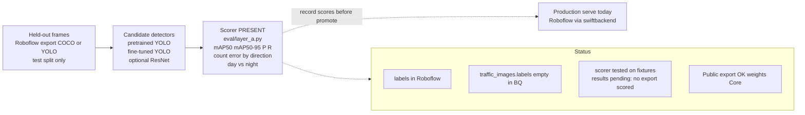
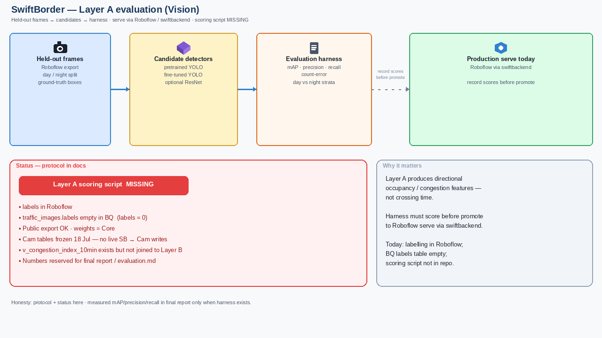
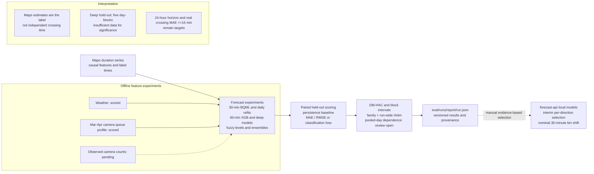
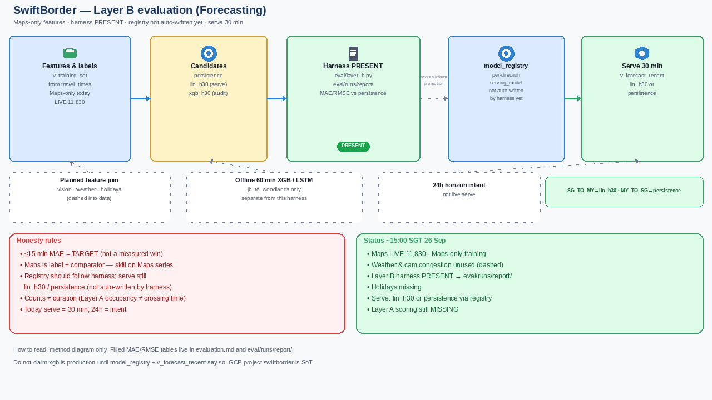

# Evaluation and reasoning

**Report section:** performance (methods, reasoning, scored results).
**Source of truth for live resources:** GCP project `swiftborder` ([inventory.md](inventory.md)).
**Source of the numbers in sections 1-7:** [`eval/runs/report/run.json`](../eval/runs/report/run.json), run `20261003T035807Z_offline-bqml-joined-deep-fuzzy-ensemble` (schema v2). Section 8 is a separate local pass and is not in that file. The report run was made from committed code (`provenance.git_sha` `b3b6562`, clean tree, `code_sha256` `39fa1c24…`); `provenance` also records the OS, CPU and every installed package, and `deep.config.tensorflow` the TensorFlow build; promotion refuses dirty runs and runs whose code hash differs from the tree. Cells marked `pending` have no harness output yet. Sections 1-6 give the same numbers as the previous report run (same data; the Layer A forecast arm of section 7 is a separate Holm family). The snapshot was not refit for this doc pass. Figure series for the cited run were replayed, without a new fit, into [`eval/runs/replay-20261003T035807Z/`](../eval/runs/replay-20261003T035807Z/). `offline/holdout-sample` was never stored, so that replay has no CSV even though `eval/runs/report/offline/holdout-sample.png` remains. The schema-v1 run `20260926T073406Z` is not replayable from this snapshot.

Protocol diagrams: [diagrams/eval-layer-a.mmd](diagrams/eval-layer-a.mmd), [diagrams/eval-layer-b.mmd](diagrams/eval-layer-b.mmd) (embedded below). The deck PNGs `images/eval-layer-a.png` and `images/eval-layer-b.png` were regenerated on 4 Oct 2026 ([diagrams/README.md](diagrams/README.md)).

---

## What would count as success

The product intent is a Woodlands-only forecast of causeway crossing time, up to 24 hours ahead, with mean absolute error at or below 15 minutes. **Both stay targets.** The live `forecast-api` emits a local-model forecast of Google Maps `duration_in_traffic` with a nominal **30-minute bin-start shift**. Longer horizons are exploratory only ([horizon-study.md](horizon-study.md)): the public curve draws the model to 5.5 h, which is the generous end of that study, and the calendar profile after that. Holm over the study's 336 comparisons keeps `xgb[maps+prof]` ahead of the profile only to 3 h. That is not a confirmed 24-hour forecast. The scored tables on this page stop at 60 minutes. The BQML results below evaluate the earlier `v_forecast_recent` policy; see [inventory.md](inventory.md) for current serving and [final-report-readiness.md](final-report-readiness.md) for timing and inference limitations. There is no independent crossing-time label to test the 15-minute target against.

---

## Reasoning

### The label is Maps' current estimate

`causeway.travel_times.duration_in_traffic_sec` is the Distance Matrix estimate at observation time. There is no second ground truth (no probe-vehicle wait, no checkpoint timestamp). Every Layer B score is skill **on the Maps series**: a model beats persistence when its error on a future Maps reading is lower than carrying the current reading forward. Say "skill over persistence on the Maps duration series", not "we beat Google".

`v_training_set` defines `y_persistence` as the mean duration in the current 10-minute bin and `y_30` / `y_60` as the bin 3 / 6 bins later. The bin mean includes readings up to the bin end, so a row is treated as known at bin start + 10 minutes. The scored 30-minute horizon is the gap from origin bin start to the label bin start (`[t+30, t+40)`); from that as-of time the label bin begins 20 minutes later. The offline default is 12 steps of 5 minutes, so `target_ts` is 60 minutes after `origin_ts`. Rainfall sums include station readings with `ts <= asof` and add no publication delay; the 2-hour forecast uses acquisition time (`update_timestamp`), or 10 minutes after issue when that stamp is missing.

### Baselines

| Baseline | Why |
| --- | --- |
| Persistence (`y_t` predicts `y_{t+h}`) | Naive forecast; required in every Layer B table |
| **Maps typical** (`duration_sec` at the origin: Google's duration without traffic) | The "vs Maps" comparator the project can actually score. It is a weak baseline (no traffic), included so the report does not only compare against itself |
| `lin_h30` | The model `v_forecast_recent` calls |
| `xgb_h30` | Trained, not served |
| Ensemble | Mean of two models; tests the hybrid/ensemble category |
| **Served** (`model_registry` choice per direction) | What `v_forecast_recent` publishes: `lin_h30` for `SG_TO_MY`, persistence for `MY_TO_SG` (section 6) |

### Layer A cannot carry the product metric

A strong detector can still leave Layer B wrong, because a queue visible in one frame is not the time to cross. Layer A is scored on detection (mAP, precision, recall, count error, day versus night). Layer B is scored on duration error. Keep the tables separate.

### Significance

Point forecasts are **paired** on the same `(direction, time)` rows. For each row, `d_i = |y_i - ŷ_i^challenger| - |y_i - ŷ_i^reference|` in minutes (negative: challenger better). Code: [`eval/significance.py`](../eval/significance.py).

| Method | Role |
| --- | --- |
| **Diebold–Mariano** on `d_i`, Newey–West (Bartlett) variance, Harvey–Leybourne–Newbold small-sample correction, Student-t(n−1) | Primary test, two-sided. HAC lag = the larger of h−1, ⌊4(n/100)^(2/9)⌋ and one day of samples (capped at n/3), because traffic loss differentials stay correlated for about a day; autocovariances stay within a direction |
| **Moving-block bootstrap** CI for mean(`d`) | Overlapping blocks of one calendar day of samples, drawn within each direction (never across) |
| **Holm** correction | Two-sided DM p-values, one family per harness family: family-wise error of any directional claim ≤ α = 0.05 |
| Paired t-test | Supplementary only (assumes independent errors; reported, not used for decisions) |

**Decision rule:** "challenger" only when the Holm-adjusted two-sided DM p < 0.05, the mean difference is negative, **and** the two-sided 95% bootstrap CI lies entirely below 0; "reference" by the mirror rule; **"insufficient data"** when a resample has fewer than 10 day-blocks (the CI is too coarse); otherwise "not significant". Very small p-values are reported as computed but should be read as "far below α", not as precise probabilities.

**Pooled comparisons (both directions; code changed 2026-10-04, after the committed snapshot).** The two routes cover the same calendar days, and a common event can move both routes' errors together, so day-blocks summed over directions overstate the evidence. Code after 2026-10-04 (`significance.py`) treats a pooled comparison differently:
- The gate counts **distinct calendar days** (`calendar_days`), not blocks summed over groups.
- The decision also needs the **joint calendar-day bootstrap** CI (`joint_ci_low_min` / `joint_ci_high_min`) to exclude 0 on the same side. That bootstrap resamples whole days with both directions' rows together.
- A **day-clustered** two-sided p-value (`day_cluster_pvalue`, t with days − 1 df) is reported as a sensitivity check.

Directional results are reported separately. A pooled "challenger" is one result, not two independent confirmations.

**"Not significant" is not "no effect" and it is not equivalence.** It means no difference was detected on that window. Equivalence was never tested, because no margin was fixed in advance. A pooled comparison uses the joint calendar-day bootstrap; failing that test does not show the two forecasts are the same.

The committed snapshot (`eval/runs/report/`, code `b3b6562`) used the earlier rule. Its 30-minute pooled comparisons cover 18 calendar days and pass the new gate. The pooled weekend slice (5 days) and every fuzzy comparison (5 days) do not, so under the new rule they are "insufficient data". The sensitivity re-run of the same cached data is summarised in [findings.md](findings.md#pooled-significance-sensitivity-2026-10-04).

**Family boundaries.** Holm is applied within one family per question, and a claim never combines rows from two families:

| Family (`run.json`) | Question | Comparisons |
| --- | --- | --- |
| `bqml` headline | Do the served-era BQML models beat persistence, overall and per direction? | 11 |
| `bqml` slices | Where (time of day, day type, light)? Exploratory, not headline | 63 |
| `joined` | Does weather (or observed camera counts) help a daily-refit model? | 15 |
| `camfc` (in `joined`) | Does the Layer A queue forecast help, and beyond a Maps profile? | 18 |
| `offline`, `deep` | 60-min single-route models vs persistence and XGBoost | 2 + 10 |
| `fuzzy` | Traffic-level classifiers | 3 |
| `ensemble` 30 / 60 min | Do combiners beat the best single model or the served forecast? | 9 + 3 |

Per-question families keep each question's family-wise error at 5%, and a new experiment does not weaken the tests of an unrelated one. The price is that across the whole report, some of the 134 comparisons will reach significance by chance. **Sensitivity check:** `run.json` → `multiplicity` repeats every decision with one run-wide Holm family, which is the most conservative option. It changes 7 of 134 decisions, all to "not significant":

- `xgb_h30` vs persistence: both directions (run-wide Holm p = 0.081) and `MY_TO_SG` (0.090).
- `lin_h30` vs persistence on `SG_TO_MY` (0.48).
- `xgb_h30` vs persistence at night (0.089).
- The camera queue forecast in XGBoost vs `xgb[maps]`: both directions (0.13) and `SG_TO_MY` (0.26).
- Fuzzy rule base vs the XGB → fuzzy hybrid (0.16).

The claims that do not depend on the family choice:
- The `lin_h30` + `xgb_h30` ensemble beats persistence.
- The daily-refit `xgb[maps]` beats persistence and the served forecast; so do the stack and the fuzzy-gated stack.
- Weather adds nothing, and no combiner beats `xgb[maps]`.
- Ridge improves with the camera forecast, and neither model improves with it beyond the Maps profile.
- The XGB → fuzzy hybrid beats the persistence level.

Claims that change are marked "(family-level only)" below.

**Practical significance.** Statistical significance says a difference is unlikely to be chance, not that it matters to a traveller. The differences here are small in absolute terms:

| Comparison (30 min, both directions) | Mean diff (min) | Seconds | Share of a ~26 min crossing |
| --- | --- | --- | --- |
| `xgb[maps]` vs served | −0.267 | ~16 | ~1% |
| `xgb[maps]` vs persistence | −0.366 | ~22 | ~1.4% |
| Camera queue forecast in XGBoost | −0.065 | ~4 | ~0.25% |
| Weather in XGBoost | +0.003 | ~0 | — |

No operational threshold was set before these results were produced. So none of them is presented as a product-relevant win, only as evidence about which inputs and models carry signal. **Proposed rule for future serving decisions** (to be adopted by the team *before* the extended-window re-run, so that it is set in advance): change the served model only if the challenger is significant under run-wide Holm **and** lowers 30-minute MAE by at least 0.5 min (30 s), roughly the rounding of a forecast shown in whole minutes. No 30-minute result on 13–30 Sep meets that bar.

References: Diebold & Mariano (1995), *J. Bus. Econ. Stat.* 13(3); Harvey, Leybourne & Newbold (1997), *Int. J. Forecasting* 13(2); Newey & West (1987), *Econometrica* 55(3); Künsch (1989), *Ann. Statist.* 17(3); Holm (1979), *Scand. J. Statist.* 6(2).

### Techniques this evaluation is accountable for

| Category | Where it shows up | Scored here |
| --- | --- | --- |
| Supervised learning | Roboflow labels; regression of future Maps duration | Layer B tables below; Layer A pending |
| Machine learning / deep learning | YOLO via Roboflow; BQML `lin_h30`, `xgb_h30`; offline XGBoost and ridge | Layer B tables below |
| Deep learning (LSTM, GRU, patch Transformer) | [`eval/deep_forecast.py`](../eval/deep_forecast.py), [`eval/timeseries_transformer.py`](../eval/timeseries_transformer.py); same rows as offline XGB | Section 4 |
| Fuzzy logic | Light / moderate / heavy traffic-level classifier with a learned fuzzy rule base ([`eval/fuzzy_traffic.py`](../eval/fuzzy_traffic.py)) | Section 5 |
| Intelligent sensing | LTA frames to directional occupancy (camera 2701 line in `camdetect`); a queue forecast learned from those detections feeds Layer B | Layer A detector metrics pending. Section 7a scores a March-April queue forecast as a Layer B input. Observed counts for the Maps window are pending (section 7c); a 2026-10-04 query still ends detections on 22 Apr 2026 |
| Hybrid / ensemble | `ensemble_mean`; ridge + XGBoost; rolling LAD stack, rolling selection and a fuzzy-gated stack over BQML and daily-refit models; XGBoost regression defuzzified into traffic levels | Sections 1, 2, 5, 6 |

---

## Layer A — vision

**Question:** on held-out frames, how well does a detector localise vehicles and recover directional counts?

**Procedure:** export a Roboflow dataset version (Public allows dataset export; weight download is Core), hold out the `test` split, and score each candidate with [`eval/layer_a.py`](../eval/layer_a.py): mAP@0.5, mAP@0.5:0.95 (101-point, class-aware), precision and recall at confidence 0.1, count error overall and per direction using the 2701 dividing line, split day (07:00–18:59 SGT) versus night. The scorer is tested on hand-computed fixtures (`eval/tests/test_layer_a.py`).

**Status:** labels live in Roboflow; `traffic_images.labels` has 0 rows; `traffic_images.metadata` is populated and is not a label table. **No export has been scored.**

**Which detector is live (2026-10-08).** `swiftbackend` defaults to Roboflow workflow **v6** (`vehicle-detection-proejct-vvehicle-detection-proejct-6-yolo26s-t1-logic`, commit `d34cc1d`). The service has no `ROBOFLOW_WORKFLOW_ID` override. `?model=v4` still calls the earlier workflow, and the page's AI panel calls both.
- **What to score:** v6 is the model to score first, against an export whose `test` split neither version trained on. Each score records the workflow id and the dataset version.
- **Older detections:** the March–April detections in `cam2701` / `cam2702` came from an earlier model and do not record which, so they are not comparable with v6 output.
- **Congestion labels are a heuristic:** the page's labels are count bands per direction (< 20 Free Flow, 20–39 Quarter Way, 40–70 Half Way, > 70 Back to Back; commit `644bc25`). They were set from 14 v6 frames and are not an evaluated classifier.
- **Cost:** the side-by-side panel makes two billed Roboflow calls per view.

<!-- mermaid:eval-layer-a -->

```mermaid
flowchart LR
  EXP["Held-out frames<br/>Roboflow export COCO or YOLO<br/>test split only"]
  CAND["Candidate detectors<br/>pretrained YOLO<br/>fine-tuned YOLO<br/>optional ResNet"]
  HARNESS["Scorer PRESENT<br/>eval/layer_a.py<br/>mAP50 mAP50-95 P R<br/>count error by direction<br/>day vs night"]
  SERVE["Production serve today<br/>Roboflow via swiftbackend"]
  EXP --> CAND --> HARNESS
  HARNESS -.->|"record scores before promote"| SERVE

  subgraph STATUS["Status"]
    S1["labels in Roboflow"]
    S2["traffic_images.labels empty in BQ"]
    S3["scorer tested on fixtures<br/>results pending: no export scored"]
    S4["Public export OK weights Core"]
  end

  HARNESS -.-> STATUS
```
<!-- /mermaid:eval-layer-a -->



### Results table

| Candidate | Split | mAP@0.5 | mAP@0.5:0.95 | Precision | Recall | Count MAE | Day | Night |
| --- | --- | --- | --- | --- | --- | --- | --- | --- |
| Pretrained | test | pending | pending | pending | pending | pending | pending | pending |
| Fine-tuned YOLO (served) | test | pending | pending | pending | pending | pending | pending | pending |
| ResNet (optional) | test | pending | pending | pending | pending | pending | pending | pending |

---

## Layer B — crossing-time forecast

<!-- mermaid:eval-layer-b -->

```mermaid
flowchart LR
  DATA["Maps duration series<br/>causal features and label times"] --> MODELS["Forecast experiments<br/>30-min BQML and daily refits<br/>60-min XGB and deep models<br/>fuzzy levels and ensembles"]
  MODELS --> SCORE["Paired held-out scoring<br/>persistence baseline<br/>MAE / RMSE or classification loss"]
  SCORE --> SIG["DM-HAC and block intervals<br/>family + run-wide Holm<br/>pooled-day dependence: review open"]
  SIG --> REPORT["eval/runs/report/run.json<br/>versioned results and provenance"]
  REPORT -.->|"manual evidence-based selection"| SERVE["forecast-api local models<br/>interim per-direction selection<br/>nominal 30-minute bin shift"]
  subgraph INPUTS["Offline feature experiments"]
    WX["Weather: scored"] --> MODELS
    PROFILE["Mar-Apr camera queue profile: scored"] --> MODELS
    CAMERA["Observed camera counts: pending"] -.-> MODELS
  end
  subgraph LIMITS["Interpretation"]
    L1["Maps estimates are the label<br/>not independent crossing time"]
    L2["Deep hold-out: five day-blocks<br/>insufficient data for significance"]
    L3["24-hour horizon and real crossing MAE <=15 min<br/>remain targets"]
  end
```
<!-- /mermaid:eval-layer-b -->



**Frozen run.** It is local only (BigQuery ML is represented by local replicas, §1a). The windows, the claims the October-only confirmation run tests (C1–C8), the 0.5-minute practical threshold and the 60-minute design are fixed in advance in [roadmap.md](roadmap.md#frozen-window-run-plan-proposed-2026-10-03-the-team-confirms-before-19-oct-2359-sgt). `generate_comparison_plots.py --data-cutoff` enforces the cutoff on every component.

**Report cutoff (2026-10-03).** Score only rows whose label or target time is at or before **2026-10-19 23:59 SGT**. Later rows may exist for the live demo and are out of every table, figure, and comparison on this page. The rule, what can still be finished before that instant, and why the offline 60-minute split still cannot reach 10 day-blocks, are in [roadmap.md](roadmap.md#evaluation-freeze-decided-2026-10-03). 24 hours and <= 15 min MAE stay targets.

### 1. Production models, 30 minutes (`eval/layer_b.py`)

**Window:** 2026-09-13 00:00 to 2026-09-30 23:50 SGT (forecast origin), both directions. The numbers below are that window, not the cutoff. `lin_h30` and `xgb_h30` were trained once on 2026-09-12 (06:15 / 06:19 UTC) with a CUSTOM split on 11–12 Sep; the harness asserts training precedes the window, so every scored row is out-of-sample. **Rows:** 5,184 (2,592 per direction), filtered to `after_gap = 0` and an exact +30-minute label (0 rows excluded). Read-only BigQuery.

| Candidate | Direction | n | MAE (min) | RMSE (min) |
| --- | --- | --- | --- | --- |
| Persistence | both | 5,184 | 2.640 | 3.894 |
| `lin_h30` | both | 5,184 | 2.777 | 3.777 |
| `xgb_h30` | both | 5,184 | 2.493 | 3.678 |
| Ensemble (mean of both) | both | 5,184 | 2.459 | 3.526 |
| Persistence | SG_TO_MY | 2,592 | 2.777 | 4.046 |
| `lin_h30` | SG_TO_MY | 2,592 | 2.580 | 3.674 |
| `xgb_h30` | SG_TO_MY | 2,592 | 2.653 | 3.883 |
| Ensemble | SG_TO_MY | 2,592 | 2.468 | 3.611 |
| Persistence | MY_TO_SG | 2,592 | 2.504 | 3.736 |
| `lin_h30` | MY_TO_SG | 2,592 | 2.974 | 3.877 |
| `xgb_h30` | MY_TO_SG | 2,592 | 2.333 | 3.461 |
| Ensemble | MY_TO_SG | 2,592 | 2.450 | 3.440 |

**Headline significance** (Holm over these 11 comparisons; mean AE difference in minutes, 95% day-block CI):

| Challenger | Reference | Direction | Mean diff | CI | Decision |
| --- | --- | --- | --- | --- | --- |
| `lin_h30` | Persistence | both | +0.136 | [+0.026, +0.259] | not significant (Holm p = 0.33) |
| `xgb_h30` | Persistence | both | −0.147 | [−0.233, −0.061] | challenger (family-level only) |
| Ensemble | Persistence | both | −0.182 | [−0.253, −0.095] | challenger |
| `lin_h30` | Persistence | SG_TO_MY | −0.198 | [−0.337, −0.076] | challenger (family-level only) |
| `xgb_h30` | Persistence | SG_TO_MY | −0.124 | [−0.268, +0.005] | not significant |
| Ensemble | Persistence | SG_TO_MY | −0.309 | [−0.414, −0.225] | challenger |
| `lin_h30` | Persistence | MY_TO_SG | +0.471 | [+0.310, +0.706] | reference (`lin_h30` worse) |
| `xgb_h30` | Persistence | MY_TO_SG | −0.170 | [−0.258, −0.052] | challenger (family-level only) |
| Ensemble | Persistence | MY_TO_SG | −0.054 | [−0.155, +0.111] | not significant |
| Ensemble | `lin_h30` | both | −0.318 | [−0.378, −0.255] | challenger |
| Ensemble | `xgb_h30` | both | −0.034 | [−0.109, +0.049] | not significant |

**Slices** (a second Holm family of 63 comparisons, exploratory): `lin_h30` is significantly worse than persistence on `MY_TO_SG` in morning peak (+0.93), evening peak (+0.79), on weekdays and in daytime; `xgb_h30` is significantly better there in morning peak (−0.29), off-peak and on weekdays. On `SG_TO_MY`, `lin_h30` is significantly better in morning peak (−0.38), on weekdays and at night. Per-direction weekend slices have only 5 day-blocks and are "insufficient data"; the combined weekend slice (10 blocks) is "not significant" for all three models. The full table is in `run.json` (`bqml.significance`, `family = slices`).

**What this supports:** the live registry choice (`SG_TO_MY` → `lin_h30`, `MY_TO_SG` → persistence) beats or matches persistence in each direction on this window. `xgb_h30` would improve `MY_TO_SG` over the served persistence, and the ensemble improves `SG_TO_MY` over persistence; neither is served. Registry changes are a separate, approved write.

Plots: `eval/runs/report/bqml/mae-by-direction.png`, `bqml/mae-diff-ci.png` (forest plot coloured by decision).

### 1a. Local replicas of the BQML models (`eval/bqml_parity.py`)

**Question:** do local copies of `lin_h30` and `xgb_h30` forecast like the BigQuery ML models? If they do, the evaluation can stay on one platform and BQML need not be maintained.

**Source:** [`eval/runs/parity-bqml/run.json`](../eval/runs/parity-bqml/run.json), run `20261003T065653Z_bqml-parity`, committed code `89996bd`, clean tree. It uses the same 5,184 rows as section 1.

**Replicas** ([`eval/bq_replica.py`](../eval/bq_replica.py)). Features, settings and training rows are read from `bq show --model` and match [`sql/bigquery/traffic_prediction/bqml_*_h30.sql`](../sql/bigquery/traffic_prediction/):

- **Training rows:** the 1,406 rows whose label was observed by 12 Sep 06:15 UTC, with 11–12 Sep held out as in BQML's custom split.
- **Linear:** ridge, L2 0.1, on standardised features.
- **Boosted trees:** 28 trees (where BQML early-stopped), learning rate 0.1, depth 4, subsample 0.8, L2 1, five seeds averaged. Trees start from 0.5 as in XGBoost 0.9, which BQML runs; current XGBoost starts from the label mean, which alone moved the replica's MAE to 2.716.

| Model | MAE both | `SG_TO_MY` | `MY_TO_SG` | Replica − BQML (CI) | Mean gap between forecasts | Correlation |
| --- | --- | --- | --- | --- | --- | --- |
| `lin_h30` (BQML) | 2.777 | 2.580 | 2.974 | | | |
| `lin_h30` (local replica) | 2.697 | 2.604 | 2.789 | −0.080 [−0.137, −0.033] | 0.43 min | 0.998 |
| `xgb_h30` (BQML) | 2.493 | 2.653 | 2.333 | | | |
| `xgb_h30` (local replica) | 2.448 | 2.603 | 2.294 | −0.045 [−0.080, −0.011] | 0.64 min | 0.995 |
| Persistence | 2.640 | 2.777 | 2.504 | | | |

**Equivalence rule** (stated in the module): the 95% day-block CI of the MAE difference lies inside ±0.5 min, the practical threshold. Both replicas pass, and both are slightly better than BQML. The replica differences are also "challenger" under Holm over the two pairs, but they are 3–5 seconds. Individual forecasts still differ by about half a minute on average (different library versions, random subsampling), so the replicas are models of the same quality, not identical copies.

**Consequence:** the frozen run is local only. `lin_bq` / `xgb_bq` [frozen] stand in for the September BQML models, and [daily] measures the retraining effect on the same platform ([roadmap.md](roadmap.md#frozen-window-run-plan-proposed-2026-10-03-the-team-confirms-before-19-oct-2359-sgt)). Serving moves to local models ([ADR 0004](adr/0004-serve-local-models.md)).

### 2. Joined features, 30 minutes (`eval/joined.py`)

**Question:** do rainfall, the 2-hour forecast, or camera-2701 queue depth reduce 30-minute MAE beyond Maps-only features?

**Data:**

- **Maps features:** rebuilt in pandas from the `travel_times` export by [`eval/features.py`](../eval/features.py). The run compared them with the live `v_training_set` on 7,172 rows (through 2026-09-30 15:20 UTC); every compared column matched (largest difference 1.4e-14, `joined.dataset.parity_with_live_v_training_set`).
- **Weather:** rainfall at station S210 (Woodlands Centre Road) and the Woodlands 2-hour forecast, fetched from data.gov.sg ([`Causeway/`](../Causeway/README.md)). The experiment reads these CSVs; at run time the BigQuery weather tables ended on 31 Aug SGT (the same rows were appended to BigQuery afterwards; see [inventory.md](inventory.md)).
- **Causality:** rainfall readings stamped at or before the forecast origin; the forecast most recently **acquired by data.gov.sg** (`update_timestamp`) at or before the origin whose valid period covers the target time.
- **Camera:** observed counts pending the backfill in [handoff-camera-pilot.md](handoff-camera-pilot.md); no Layer A output exists for this window. A Layer A *forecast* is scored in section 7a.

**Design:** rolling-origin daily folds, test days 13–30 Sep SGT (18 folds, 5,184 rows, same window as section 1). Each fold trains on rows whose label was observed before the test day. Models: ridge (median imputation + missing indicators) and XGBoost (seed 42); ensemble = their mean.

| Candidate | Features | MAE (min) | RMSE (min) |
| --- | --- | --- | --- |
| Persistence | — | 2.640 | 3.894 |
| Maps typical | — | 12.816 | 15.650 |
| Ridge | Maps | 2.500 | 3.553 |
| XGBoost | Maps | 2.275 | 3.311 |
| Ensemble | Maps | 2.306 | 3.324 |
| Ridge | Maps + weather | 2.511 | 3.573 |
| XGBoost | Maps + weather | 2.277 | 3.314 |
| Ensemble | Maps + weather | 2.313 | 3.337 |
| any | Maps + weather + camera | pending | pending |

Significance (Holm over 15 comparisons, both directions):

| Challenger | Reference | Mean diff (both) | CI | Decision |
| --- | --- | --- | --- | --- |
| XGBoost [Maps] | Persistence | −0.366 | [−0.486, −0.246] | challenger (also in each direction) |
| XGBoost [Maps] | Maps typical | −10.54 | [−11.52, −9.62] | challenger |
| XGBoost [Maps + weather] | XGBoost [Maps] | +0.003 | [−0.015, +0.022] | not significant |
| Ridge [Maps + weather] | Ridge [Maps] | +0.011 | [−0.002, +0.025] | not significant |
| Ensemble [Maps + weather] | XGBoost [Maps + weather] | +0.036 | [−0.003, +0.075] | not significant (also on `MY_TO_SG`: +0.076, Holm p = 0.064) |

**Finding:** on 13–30 Sep, weather features did **not** reduce 30-minute MAE (difference indistinguishable from zero for both models, and slightly positive). An XGBoost refit daily on Maps-only features beats persistence by about 0.37 min. The observed-count camera arm is pending: no camera-2701 frames have been scored for this window (0% coverage), and a camera row is marked insufficient below 60% coverage of test rows. The queue-forecast arm is scored in section 7a.

Plots: `eval/runs/report/joined/joined-mae-diff.png`, `joined/joined-mae-by-feature-set.png`.

### 3. Offline 60 minutes, one route (`eval/timeseries_xgb.py`)

**Scope:** `jb_to_woodlands` only (JB → SG). 5-minute grid, 60-minute horizon. Export of 14,366 rows (the cached export used by the run; 7,183 on this route), observed 2026-09-06 01:53 to 2026-10-01 00:30 SGT. Chronological 80/20 split on target time: training labels end before **2026-09-26 01:35 SGT**; 1,428 test rows. Inputs are causal (forward-fill up to 30 minutes, no bfill, slew cap on inputs only); labels are raw observations; `duration_sec` is taken at the origin; persistence is the last observation at or before the origin, 60 minutes before the label (up to 30 minutes older when bins are missing, the same input the model sees).

| Candidate | Rows | MAE (min) | RMSE (min) |
| --- | --- | --- | --- |
| XGBoost (sklearn) | hold-out, 1,428 | 3.469 | 4.958 |
| Persistence T-60 | hold-out, 1,428 | 4.677 | 6.386 |
| Maps typical | hold-out, 1,428 | 14.715 | 16.880 |
| XGBoost (actual lag window) | backtest 27–30 Sep, mean of days | 3.515 | 4.957 |
| Persistence T-60 | backtest 27–30 Sep | 4.739 | 6.440 |
| Naive D-1/D-7 blend | backtest 27–30 Sep | 4.641 | 6.297 |

XGBoost vs persistence T-60 on the hold-out: −1.208 min, CI [−1.594, −0.660], two-sided DM p = 6.5e-07. XGBoost vs Maps typical: −11.25 min, CI [−12.32, −10.27]. Both decisions are **insufficient data**: the hold-out spans 5 day-blocks, below the 10 required. The point estimates and all four backtest days favour XGBoost; a significance claim needs a longer hold-out.

Backtest days are full days after the split. These numbers replace the 2026-09-26 offline results, which used the value 115 minutes before the target as "persistence T-60", a target-time Maps feature, smoothed labels, and backtest days inside the training period.

**Window features (not in the table).** Chad's day-2 note suggested a wavelet because trees get a ready-made trend and bend from it. [`eval/timeseries_xgb.py`](../eval/timeseries_xgb.py) can score three sets on this same split and the same `XGBTrainConfig`: (A) lags only, (B) lags plus a causal first difference and a 60-minute rolling mean (12 bins of 5 minutes, the same span as `keep_lags` and the horizon), (C) lags plus a per-window z-score wavelet. The default wavelet is Daubechies db2 at level 2; level 3 is a parameter. db4 is not the default because it smooths the bends. Mean and standard deviation of the window are separate columns so normalization does not throw away the level. `use_dwt` stays off for the rows above. Run `python timeseries_xgb.py` from `eval/` against `data/causeway_gdata.csv`. The hold-out in this section has 5 day-blocks, so a significance decision on that split is "insufficient data" (Diebold-Mariano, day-block bootstrap, and Holm need 10). Point estimates from the command are not part of this table.

Plots: `eval/runs/report/offline/backtest-mae.png`, `offline/holdout-sample.png`, `offline/holdout-mae-diff.png`. Replay CSVs for the first and third are under `eval/runs/replay-20261003T035807Z/offline/`. `offline/holdout-sample` has no replay CSV: that series was never stored.

### 4. Deep sequence models, 60 minutes, one route (`eval/deep_forecast.py`)

**Question:** do recurrent or attention models beat XGBoost on the same rows as section 3?

**Design:** the same 1,428 test rows and training rows as section 3 (asserted in code). Each model sees the 36-step (3 h) window of 9 channels ending at the origin. All models share one protocol: inputs standardised on the fit rows; the last 15% of training rows (by time) for early stopping; the target is the change from the value at the origin (persistence-anchored), standardised; Huber loss, AdamW (weight decay 1e-4), learning rate halved on plateaus, best weights restored. Three seeds per model; the scored forecast is the seed mean.

- **LSTM(64)** and **GRU(64)**, each followed by dropout and Dense(32) → Dense(1): 21,057 and 16,513 weights.
- **Patch Transformer** ([`timeseries_transformer.py`](../eval/timeseries_transformer.py), 19,297 weights): the window is cut into six 30-minute patches, each projected to 32 dimensions, plus a learned position embedding; two pre-LayerNorm encoder blocks (4-head self-attention, GELU feed-forward of width 64, dropout 0.1); final LayerNorm, flatten, one linear output. The parameter budget matches the LSTM so the comparison is about architecture, not size.
- **Ablation:** the same Transformer trained on the raw duration instead of the anchored change.

| Candidate | MAE (min), seed mean forecast | MAE by seed | RMSE (min) |
| --- | --- | --- | --- |
| XGBoost (section 3) | 3.469 | — | 4.958 |
| LSTM(64), anchored | 3.970 | 4.120 / 3.972 / 4.347 | 5.423 |
| GRU(64), anchored | 4.030 | 4.194 / 4.074 / 3.975 | 5.433 |
| Patch Transformer, anchored | 4.192 | 4.528 / 4.325 / 4.161 | 5.772 |
| Patch Transformer, raw target | 4.491 | 4.753 / 4.883 / 4.599 | 6.222 |
| Persistence T-60 | 4.677 | — | 6.386 |

Paired differences (Holm over 10 comparisons): LSTM −0.707 [−1.313, −0.211], GRU −0.647 [−0.899, −0.346] and the anchored Transformer −0.485 [−1.000, +0.003] min against persistence; against XGBoost, +0.501, +0.561 and +0.723 min. Anchoring the Transformer's target changed its MAE by −0.298 [−0.604, −0.003]. **Every decision is "insufficient data"** (5 day-blocks, below 10).

**Finding:** all three deep models point to an improvement over persistence, and none gets close to XGBoost; the Transformer is the weakest of the three. Anchoring on the current value is what makes the sequence models competitive at all. Reasons and when to revisit: [deep-learning-assessment.md](deep-learning-assessment.md).

Plots: `eval/runs/report/deep/deep-mae-by-seed.png`, `deep/deep-mae-diff.png`.

### 5. Fuzzy traffic level, 60 minutes, both directions (`eval/fuzzy_traffic.py`)

**Question:** can the forecast be stated as a traffic level (light / moderate / heavy), and does a fuzzy classifier predict that level better than carrying the current level forward?

**Levels:** on Maps travel time at the target time, fixed before scoring and shared by both directions: light < 20 min ≤ moderate < 35 min ≤ heavy (free flow is about 10–13 min, so roughly 1.5× and 2.5× free flow). Trapezoidal memberships sum to 1 and cross at 0.5 exactly at the cut points, so the level with the highest membership is the crisp level, and values near a boundary get graded membership.

**Classifiers:** trained per direction on the offline split of section 3, applied to both routes (1,428 test rows each, 2,856 in total).

- **Persistence level:** the level of the travel time at the origin.
- **Fuzzy rule base:** five fuzzy inputs, all known at the origin:
  - travel time now (light/moderate/heavy)
  - 30-minute trend (falling/steady/rising)
  - time of day at the target (night/morning/midday/evening)
  - workday or not
  - the travel time one day earlier at the target time

  All 216 antecedent combinations are candidate rules. Each rule's consequent and certainty factor are learned from training compatibilities (Ishibuchi-style). Rules with a non-positive certainty or too little support are dropped: 155 and 158 of 216 are kept. Inference uses a single winning rule; the persistence level is used when no rule fires.
- **XGB forecast → fuzzy level (hybrid):** the section 3 XGBoost regressor per direction, with its 60-minute forecast fuzzified by the same partition.

| Classifier | Accuracy | Macro-F1 | Recall light / moderate / heavy | Severe errors (light↔heavy) | RPS |
| --- | --- | --- | --- | --- | --- |
| Majority level (train) | 0.470 | 0.213 | 0 / 1 / 0 | 0.000 | — |
| Persistence level | 0.690 | 0.678 | 0.773 / 0.675 / 0.585 | 0.0056 | 0.120 |
| Fuzzy rule base | 0.718 | 0.698 | 0.839 / 0.710 / 0.534 | 0.0025 | 0.116 |
| XGB forecast → fuzzy level | **0.785** | **0.770** | 0.787 / 0.849 / 0.631 | 0.0007 | **0.082** |

RPS is the ranked probability score of the normalised class degrees (ordinal, lower is better). Significance uses the 0/1 misclassification loss, so the difference is in error rate (Holm over 3 comparisons). The decisions below are the committed snapshot's: 10 day-blocks, counted as two directions × 5 days. Both routes cover the same days, and the sensitivity run counts 6 shared calendar days. Under the pooled rule (see [Significance](#significance)) **all three are "insufficient data"**. Read the table as point estimates only:

| Challenger | Reference | Error-rate difference | CI | Decision |
| --- | --- | --- | --- | --- |
| Fuzzy rule base | Persistence level | −0.028 | [−0.075, +0.017] | not significant |
| XGB → fuzzy level | Persistence level | −0.096 | [−0.113, −0.067] | challenger |
| Fuzzy rule base | XGB → fuzzy level | +0.067 | [+0.021, +0.105] | reference (the hybrid is better; family-level only) |

**Finding:** the learned rule base is readable (for example, "IF now is heavy AND trend is rising AND time is evening AND workday AND yesterday heavy THEN heavy", CF 0.85). It halves severe errors against persistence. The hybrid, a regression forecast followed by fuzzy level assignment, has the best accuracy of the three. With 6 shared calendar days, neither ranking is a significance claim. Heavy traffic on `MY_TO_SG` is the weak spot for every classifier (recall 0.38–0.47). Per-direction rows and the top rules are in `run.json` (`fuzzy`).

Plots: `eval/runs/report/fuzzy/fuzzy-memberships.png`, `fuzzy/fuzzy-confusion.png`.

### 6. Ensembles and hybrids of the Layer B models (`eval/ensemble.py`)

**Question:** does combining the existing forecasters beat the best single one, and how much would the served forecast gain?

**Pool (30 min, both directions, 13–30 Sep):** the BQML models of section 1 and the daily-refit Maps-only models of section 2, joined on (direction, bin) with identical labels (5,184 of 5,184 rows matched), plus persistence. Every combiner uses only earlier days of the window. A row counts as earlier once its label has been observed (bin + 40 min) before the test day starts. The first two days use equal weights. `xgb[maps]` is `BEST_SINGLE_30` in `eval/ensemble.py` because it was the lowest-MAE single model on this same window; there is no later untouched period.

- **Equal mean** of the four models (`lin_h30`, `xgb_h30`, `ridge[maps]`, `xgb[maps]`).
- **Rolling LAD stack:** convex weights per direction over the five pool members, fitted by least absolute deviation on all earlier days.
- **Rolling selection:** per direction, the member with the lowest MAE over the previous three days (a rolling version of the registry).
- **Fuzzy-gated stack (hybrid):** one set of stack weights per traffic level of the current travel time (section 5 partition). Each set is fitted with membership-weighted LAD, and the forecast is blended by membership.

| Candidate | MAE both | `SG_TO_MY` | `MY_TO_SG` | RMSE both |
| --- | --- | --- | --- | --- |
| Persistence | 2.640 | 2.777 | 2.504 | 3.894 |
| **Served** (registry) | 2.542 | 2.580 | 2.504 | 3.705 |
| `ensemble_mean` (`lin_h30` + `xgb_h30`) | 2.459 | 2.468 | 2.450 | 3.526 |
| `xgb[maps]` (daily refit, best single) | 2.275 | 2.399 | 2.150 | **3.311** |
| Equal mean of 4 models | 2.358 | 2.400 | 2.316 | 3.389 |
| Rolling LAD stack | **2.253** | **2.366** | **2.140** | 3.359 |
| Rolling selection | 2.291 | 2.379 | 2.204 | 3.378 |
| Fuzzy-gated stack | 2.268 | 2.389 | 2.146 | 3.376 |

Significance (Holm over 9 comparisons, both directions):

| Challenger | Reference | Mean diff | CI | Decision |
| --- | --- | --- | --- | --- |
| Served | Persistence | −0.099 | [−0.169, −0.040] | not significant (Holm p = 0.074) |
| Equal mean of 4 | `xgb[maps]` | +0.083 | [+0.030, +0.152] | not significant (Holm p = 0.074) |
| Rolling LAD stack | `xgb[maps]` | −0.021 | [−0.074, +0.042] | not significant |
| Rolling selection | `xgb[maps]` | +0.016 | [−0.042, +0.090] | not significant |
| Fuzzy-gated stack | `xgb[maps]` | −0.007 | [−0.063, +0.060] | not significant |
| Fuzzy-gated stack | Rolling LAD stack | +0.015 | [−0.003, +0.038] | not significant |
| `xgb[maps]` | Served | −0.267 | [−0.371, −0.146] | challenger |
| Rolling LAD stack | Served | −0.288 | [−0.349, −0.199] | challenger |
| Fuzzy-gated stack | Served | −0.274 | [−0.341, −0.177] | challenger |

On 30 Sep the stack put about 0.61 of its weight on `xgb[maps]`, 0.24 on persistence, 0.13–0.15 on `xgb_h30` and none on either linear model (`weights_30min` in `run.json`).

**Where the error is:** rows are split by the observed 30-minute change (diagnostic only, it uses the label). Changes of more than 5 minutes up ("rising", 8.5% of rows) or down ("falling", 8.0%) carry 39% of `xgb[maps]`'s absolute error (MAE 5.32 and 5.57 min, against 1.65 min when steady). The stack is better than `xgb[maps]` in steady traffic (1.44 min) and worse at onsets (6.76 min rising): it shrinks toward persistence, which is what the stack is for, and that is also why it gains nothing overall.

**60 minutes, one route:** the equal mean of XGBoost and the three deep models scored 3.655 min, the deep-only mean 3.929 and a rolling stack 3.561, all against XGBoost's 3.469. Every decision is "insufficient data" (5 blocks).

**Finding:** ensembling and hybridising add nothing measurable over the best single model. The daily-refit `xgb[maps]` is within 0.02 min of every combiner, and the equal mean is worse. The gain available now is from **what is served**: replacing the registry choice with `xgb[maps]` or the stack would cut 30-minute MAE by about 0.27–0.29 min, about 16–17 seconds (significant, also under run-wide Holm; below the proposed 0.5-min serving threshold). The served choice itself is not significantly better than persistence on this window. These are historical BQML-era comparisons. Current local serving and its selection policy are documented in [ADR 0004](adr/0004-serve-local-models.md); the harness does not deploy a selection.

Plots: `eval/runs/report/ensemble/ensemble-30min-mae-diff.png`, `ensemble/ensemble-60min-mae-diff.png`.

### 7. Is Layer A output a meaningful Layer B input?

**Observed camera counts cannot be tested yet: no Layer A output overlaps the Maps label.** A Layer A **forecast** can be, and is (below). Checked with read-only queries on 2026-10-01:

| Data | Range | Overlap with `travel_times` (from 2026-09-05 17:53 UTC) |
| --- | --- | --- |
| `cam2701.Cam2701` detections (Layer A output) and view `v_congestion_index_10min` | 2026-03-13 to 2026-04-22 (33 days, 3,513 frames) | none |
| `cam2702.Cam2702` detections | 2026-03-13 to 2026-04-22 (33 days) | none |
| `traffic_images.metadata` frames for 2701 (raw images, no detections) | to 2026-09-11 23:55, about 144 per day in Sep | frames only, 6–11 Sep |
| data.gov.sg traffic-images history (backfill source) | on request | frames only; needs billed Roboflow inference |
| `swiftbackend` live calls | not persisted | none |


#### 7a. Layer A forecast as a Layer B input (`eval/camera_forecast.py`, scored in `eval/joined.py`)

To get around the missing overlap, Layer B gets a **forecast of the camera count** instead of the observed count. The forecast is a model trained on the Layer A output that does exist.

- **Layer A forecaster:** trained on the camera-2701 detections in `v_congestion_index_10min` (13 Mar–22 Apr 2026). Days with fewer than 40 bins in a direction are dropped (5,631 → 5,400 rows, 28 days per direction). Per direction, it is a ridge regression of the 10-minute vehicle count on time-of-day Fourier terms × weekend. The number of harmonics was chosen by 5-fold leave-days-out CV (K = 8).
- **How good is it** (CV MAE in vehicles per frame, `MY_TO_SG` / `SG_TO_MY`): direction mean 43.8 / 8.9; hour × day-type mean 35.1 / 6.9; Fourier K=8 **34.5 / 6.8**.
- **Features:** `camfc_now` (expected count at the origin) and `camfc_30` (at the label bin). `camfc_delta` is the expected queue build-up or clearing over the next 30 minutes. The forecast depends only on the calendar, so it is known in advance for every Maps row, and it was fitted on data months before the window.
- **Control:** `mpfc`, the same estimator fitted inside each fold on the Maps training rows (current travel time). It asks whether a gain is camera information or just time-of-day shape.
- **Design:** the same 18 rolling daily folds and 5,184 rows as section 2. These comparisons are their own Holm family (18 comparisons), so section 2's family is unchanged.

| Candidate | MAE both | `SG_TO_MY` | `MY_TO_SG` | RMSE both |
| --- | --- | --- | --- | --- |
| XGBoost [Maps] | 2.275 | 2.399 | 2.150 | 3.311 |
| XGBoost [Maps + camera forecast] | 2.210 | 2.311 | 2.108 | 3.202 |
| XGBoost [Maps + Maps profile] (control) | 2.216 | 2.352 | 2.081 | 3.210 |
| XGBoost [Maps + Maps profile + camera forecast] | 2.242 | 2.398 | 2.087 | 3.261 |
| Ridge [Maps] | 2.500 | 2.523 | 2.478 | 3.553 |
| Ridge [Maps + camera forecast] | 2.447 | 2.510 | 2.385 | 3.490 |
| Ridge [Maps + Maps profile] (control) | 2.370 | 2.476 | 2.263 | 3.377 |

| Challenger | Reference | Mean diff (both) | CI | Decision |
| --- | --- | --- | --- | --- |
| XGBoost [+ camera forecast] | XGBoost [Maps] | −0.065 | [−0.107, −0.029] | challenger (also `SG_TO_MY`: −0.089); family-level only |
| Ridge [+ camera forecast] | Ridge [Maps] | −0.053 | [−0.077, −0.028] | challenger (also `MY_TO_SG`: −0.093) |
| XGBoost [+ camera forecast] | XGBoost [+ Maps profile] | −0.007 | [−0.045, +0.057] | not significant |
| XGBoost [+ Maps profile + camera forecast] | XGBoost [+ Maps profile] | +0.026 | [−0.000, +0.049] | not significant |
| Ridge [+ camera forecast] | Ridge [+ Maps profile] | +0.078 | [−0.005, +0.187] | not significant |

By regime (observed 30-min change of more than 5 min; diagnostic), XGBoost MAE:

| Regime | [Maps] | [+ camera forecast] | [+ Maps profile] |
| --- | --- | --- | --- |
| rising | 5.324 | 4.859 | 4.607 |
| steady | 1.650 | 1.639 | 1.741 |
| falling | 5.566 | 5.366 | 4.644 |

**Finding:** the Layer A queue forecast is a **meaningful but small input**: about 4 seconds of MAE for XGBoost, below any practical threshold (see Significance). It reduces 30-minute MAE significantly for both model types (for XGBoost only within its family; ridge also under run-wide Holm), most at queue onsets (−0.47 min when traffic is rising). The gain is the same as a Maps-derived daily profile, however, and adding the camera forecast on top of that profile adds nothing. What transfers from March–April camera data is **the shape of the daily queue cycle**: when queues build and clear, which Layer B does not get from its time-of-day features alone. It is not information the Maps series lacks. The camera forecast does have one practical property: it is fixed from a separate sensor and period and needs no Maps history. Testing whether **observed** counts add information beyond that profile still needs the backfill.

Caveats:
- The congestion view drops frames with zero vehicles, so night counts are biased up.
- March and April differ from September in school terms and holidays.
- The forecast is a prior, not a live sensor, so it cannot see today's incidents.

Plots: `eval/runs/report/joined/camfc-mae-diff.png`, `joined/camfc-profiles.png`.


#### 7b. Could Layer A output replace the Distance Matrix data?

**Not on current evidence.** The results support a narrower statement: *camera-derived queue counts follow the same daily cycle as Maps travel time, and a queue forecast learned from them improves the 30-minute forecast as much as a Maps-derived profile does.* They do not support "Layer A output is highly correlated with the Layer B target", and they do not make camera counts a substitute for Distance Matrix.

Why the stronger claim is not supported:

- **No paired observations.** No camera count and Maps reading have ever been observed for the same time (the table at the start of section 7), so no row-level correlation has been measured.
- **What section 7a shows is shared shape, not measurement.** The camera forecast depends only on the calendar. Its gain equals a Maps-derived profile's, and it adds nothing on top of that profile. That is evidence that both series have the same daily cycle, not that a count tracks today's travel time.
- **Averaged profiles overstate agreement.** Comparing hour-of-day means from different months hides the within-day variation that a substitute would have to follow. Any such comparison should not be quoted as a correlation between Layer A and Layer B.

Why a substitute is a larger step than an input:

- **Counts saturate.** Once the frame is full the count plateaus, while the queue, and the crossing time, keep growing beyond the frame.
- **Counts do not show speed.** A full frame of moving traffic and a full frame of stopped traffic give similar counts. The `extent` measure helps a little. Speed would need tracking across frames, which are about 10 minutes apart.
- **One camera sees one stretch.** Camera 2701 does not see the checkpoint queue or the Johor side.
- **A substitute still needs a label.** Any count-to-duration model is calibrated against something, and today that is Maps. Without an independent ground truth, the realistic role for Layer A is a fallback or complement (for example during a Distance Matrix outage or to cap API cost), not a replacement.
- **Visibility.** Fog, haze, heavy rain, night glare, lens obstruction, and stale or missing LTA frames make frames unusable. The dangerous case is a frame where nothing is visible: it scores as "0 vehicles" and would read as free-flowing traffic. The backfill records missing and stale frames as missing, but it cannot yet tell a foggy frame from an empty road; a visibility check is needed before any substitute use.

**What would test it:** raw camera 2701 frames exist for 6–11 Sep in `traffic_images.metadata` and on data.gov.sg (about 144 per day), and they overlap the Maps label. Scoring them costs about 864 Roboflow calls (`backfill_camera_counts.py --mode full --start 2026-09-06 --end 2026-09-11`). With those counts, three checks become possible:

1. Row-level correlation of count and `extent` with Maps travel time, per direction, with day-block intervals.
2. A camera-only estimate of the current travel time (counts, extent and calendar), against a calendar-only baseline. This is the direct test of substitution.
3. A visibility flag (image brightness or contrast, or no detections at a time when some are expected), so unusable frames are counted as missing and reported separately.

Six days is short. Significance decisions will probably be "insufficient data", but the correlation and the camera-only error would show whether substitution is worth pursuing. The harness for these checks is not built yet.

#### 7c. Observed counts (pending)

Observed counts depend on the camera backfill ([handoff-camera-pilot.md](handoff-camera-pilot.md)). Once it has run, the "Maps + weather + camera" arm of section 2 answers the question with the same folds and the same significance rules. The test should be against `maps+mpfc`, not `maps`, so a time-of-day prior is not credited to the camera.

**What the current data says about observed counts:**

- **Where it could help.** Camera counts measure the queue now, and Layer B already sees the travel time now and its lags. A camera can only add information where the Maps lags do not anticipate the change, which is the onset and clearing of queues. Those rows (16.5% of rows, observed change above 5 minutes) carry 39% of `xgb[maps]`'s error (section 6). If a camera input removed all of it, 30-minute MAE would fall by at most about 0.9 min (0.39 × 2.275). A realistic gain is a fraction of that.
- **How small a gain is detectable.** Nested-feature comparisons are precise. Adding weather to `xgb[maps]` gave a 95% CI of [−0.015, +0.022] min (section 2). With full camera coverage of 13–30 Sep, a gain of a few hundredths of a minute would be detectable. Partial coverage widens the interval, and below 60% of test rows the arm is reported as insufficient.
- **The direction mapping and causality are in place.** `features.add_camera` takes the last frame at or before bin + 10 min and at most 30 minutes old, maps SG-MY / MY-SG to the Layer B directions, and records a scored frame with no vehicles as 0 and a missing frame as missing.

### Do not combine

Do not put the 60-minute one-route numbers and the 30-minute two-direction numbers in one headline. The 30-minute production window (section 1) is the headline for the served system.

---

### 8. TimesFM 2.5 and FCM + MLP (shared 13-30 Sep window, 2026-10-05)

These two modules live in `Causeway/` and are not part of the frozen run above. Skill is still on the Maps duration series. Labels stay at or before 2026-10-19 23:59 SGT. `fcm_mlp_layer_a` and `timesfm_layer_a` are not scored: camera detections end on 22 Apr 2026 and do not overlap this Maps window.

The earlier pass fit the TimesFM residual on 25 Sep only and scored both models on origin days 26-30 Sep. That is not this comparison. `xgb[maps]` on those five days was the section 2 daily refit, which had already seen the weeks before 26 Sep.

**Protocol.** Both directions, the section 2 origin window 13-30 Sep 2026 SGT, label `y_30` (the bin that starts 30 minutes after the origin), and `after_gap = 0`. All 5,184 reference rows paired on `(direction, bin_ts)`; none were dropped. Persistence on these rows is 2.640 min, the same cell as section 2. `xgb[maps]` is a fresh `eval.joined` daily refit on Maps features only (`replicas=False`): each test day trains on rows whose label ends at or before that day starts (`bin_ts + 40 min`). That refit scores 2.276 min; the frozen-run cell in section 2 is 2.275 on this same window. `fcm_mlp` and the no-FCM `mlp` use the module defaults (c = 3, m = 2, MLP 32-16, five seeds) and refit on each test day from that same allowed history; the network's two-day inner split is the last two of those allowed days, so early stopping does not see the test day. TimesFM 2.5 is not retrained: each origin is one BigQuery `AI.FORECAST` series (context window 1024, about 7 days of bins at or before the origin, horizon 6, project `swiftborder`, location `US`), one query per SGT day from 6-30 Sep, with no table write. 6 Sep had no eligible origin. The residual ridge for `timesfm_calibrated` is refit every test day on the same label-end rule (1,988 joined rows on 13 Sep, 6,884 on 30 Sep). No production table was written: not `lin_h30`, `xgb_h30`, `model_registry`, `v_forecast_recent`, `layer_b_backtest`, or `layer_b_registry`. The table in [Causeway/layer-b-fcm-mlp-results.md](../Causeway/layer-b-fcm-mlp-results.md) is the modules' own 26-30 Sep split, not this table.

Labels matched. Every TimesFM step-3 `actual` equalled `y_30`, and its persistence equalled `y_persistence`. Every `fcm_mlp` step-3 label equalled `y_30`. Significance is `eval/significance.py` (`compare_absolute_errors`, day blocks, Singapore offset, 4,999 resamples, seed 0, horizon step 3). Each model has its own Holm family of four, both directions pooled, and the decision uses the joint calendar-day 95% interval. Eighteen calendar days clears the 10-day gate, so a decision is allowed. This is 30 minutes only; `xgb[maps]` in this protocol is a 30-minute model.

| Candidate | n | MAE (min) | Calendar days |
| --- | --- | --- | --- |
| Persistence | 5,184 | 2.640 | 18 |
| `xgb[maps]` (daily refit, same rows) | 5,184 | 2.276 | 18 |
| `timesfm` | 5,184 | 2.340 | 18 |
| `timesfm_calibrated` | 5,184 | 2.310 | 18 |
| `mlp` (no FCM) | 5,184 | 2.226 | 18 |
| `fcm_mlp` | 5,184 | 2.230 | 18 |
| Mean of `fcm_mlp` and `xgb[maps]` | 5,184 | 2.134 | 18 |

TimesFM family (Holm over these four):

| Challenger | Reference | Mean diff (min) | Joint day 95% CI | Decision |
| --- | --- | --- | --- | --- |
| `timesfm` | Persistence | -0.300 | [-0.421, -0.161] | challenger |
| `timesfm` | `xgb[maps]` | +0.064 | [-0.071, +0.208] | not significant (Holm p = 0.51) |
| `timesfm_calibrated` | Persistence | -0.330 | [-0.421, -0.225] | challenger |
| `timesfm_calibrated` | `xgb[maps]` | +0.034 | [-0.110, +0.170] | not significant (Holm p = 0.54) |

FCM family (Holm over these four):

| Challenger | Reference | Mean diff (min) | Joint day 95% CI | Decision |
| --- | --- | --- | --- | --- |
| `fcm_mlp` | Persistence | -0.411 | [-0.529, -0.248] | challenger |
| `fcm_mlp` | `xgb[maps]` | -0.047 | [-0.159, +0.047] | not significant (Holm p = 0.59) |
| `mlp` (no FCM) | `xgb[maps]` | -0.050 | [-0.151, +0.028] | not significant (Holm p = 0.59) |
| Mean of `fcm_mlp` and `xgb[maps]` | `xgb[maps]` | -0.142 | [-0.211, -0.090] | challenger |

Against persistence, `timesfm`, `timesfm_calibrated` and `fcm_mlp` have lower error on the Maps duration series. Against `xgb[maps]`, the TimesFM point estimates are slightly higher and not significant, and `fcm_mlp` is 0.047 min lower and not significant. The equal mix is a challenger versus `xgb[maps]` in this family (Holm p = 5.7e-06) by 0.142 min, which is under the 0.5 min bar in the Significance section. **That result is exploratory.** The mix was formed after scoring on 13–30 Sep, the window that also chose the frozen-run arms. It is not among the frozen-run claims C1–C8, and it has its own Holm family of four instead of the run-wide check. It needs the October-only Run B before it is claimed; the proposed claim is C9 in [roadmap.md](roadmap.md). TimesFM is scored through BigQuery `AI.FORECAST`. That is an exception to the local-only evaluation (roadmap item 0), allowed because no BigQuery ML model is trained or compared and nothing is written. **Served selection is unchanged** (`lin_bq[frozen]` for `SG_TO_MY`, persistence for `MY_TO_SG`). `timesfm`, `timesfm_calibrated` and `fcm_mlp` stay off the forecast mix and are not callable.

---

## Reproduce

The report run used the cached Maps export `eval/data/causeway_gdata.csv` (its SHA-256 is `offline.dataset.cache.sha256` in `run.json`). To reproduce it, keep that file and do **not** pass `--refresh-bq`:

```bash
cd eval
pip install -r requirements-dev.txt
pip install -r requirements-notebook.txt     # TensorFlow, for --deep
python generate_comparison_plots.py --bqml --window-end "2026-09-30 23:50" --joined --deep --fuzzy --ensemble
python promote_report_run.py --check
python promote_report_run.py <run_id>
```

The deep component takes about 10–15 minutes on CPU. With the same TensorFlow build it reproduces the per-seed MAEs exactly; other builds can differ in the last digits.

Adding `--refresh-bq` downloads a newer export: that extends the data and is a new result, not a reproduction. `--allow-dirty` on promotion is only for a recorded reason.

Weather CSVs: see [Causeway/README.md](../Causeway/README.md). Camera counts: `python backfill_camera_counts.py --dry-run` (billed against Roboflow credits; see [eval/README.md](../eval/README.md)). Run layout and the manifest schema: [eval/runs/README.md](../eval/runs/README.md).

---

## Principal risks

**Counts are not crossing duration.** Report Layer A and Layer B separately. A low count error does not imply a low MAE. A shared daily cycle is not evidence that counts can replace the Distance Matrix label (section 7b); obscured frames (fog, haze, glare) look like empty roads.

**The label is not an independent clock.** Report skill against persistence on the Maps series. Do not write "we beat Google" from that comparison.

**Short history.** The 30-minute window is 18 days; the offline hold-out is 5 days. Day-block intervals are coarse and results can change with more data.
