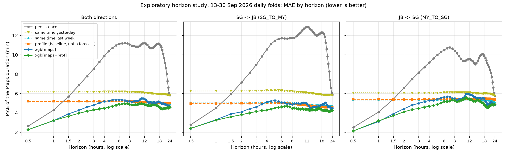
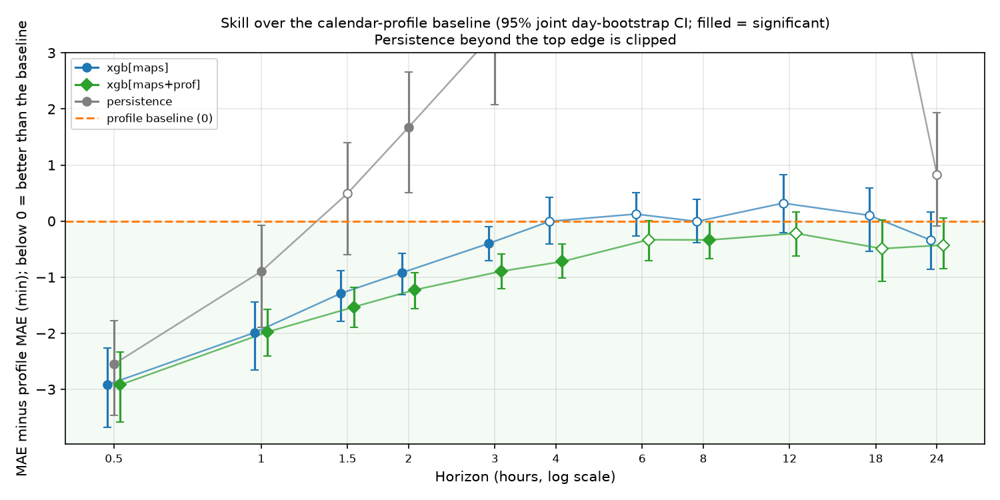
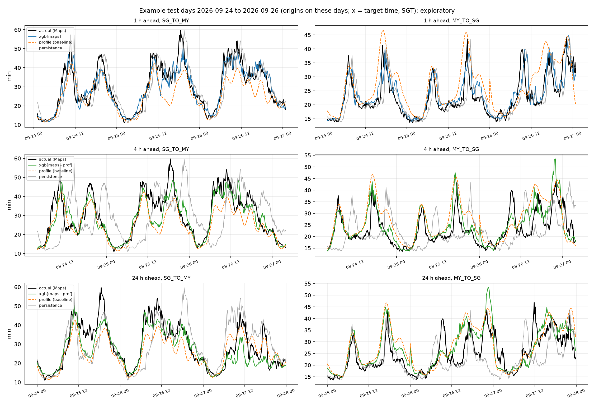

# Horizon study: 30 minutes to 24 hours (exploratory)

**Status:** exploratory, recorded 2026-10-04. These are not report results. The study reuses the 13–30 Sep window that already informed the 30-minute design, so any horizon or arm chosen from it must be confirmed on the October-only Run B ([roadmap.md](roadmap.md)) before it is claimed. The label is Google Maps' `duration_in_traffic`, not a measured crossing time.

**Reproduce:** `cd eval; python horizon_study.py` (several minutes on a laptop CPU). It writes results and the three charts below to `eval/runs/horizon-study/` (gitignored), each chart with a CSV of the plotted series. `python horizon_study.py --publish` also copies the charts to `docs/images/horizon-study/` and writes `forecastapi/horizon_study.json`, the summary `forecast-api` serves.

**Exposed on purpose.** These figures are shown in the API and the frontend, labelled exploratory: the project wants them visible. See [What is served](#what-is-served). Data: the report cache `eval/data/causeway_gdata.csv` (sha256 `13a11998…`, the same file as `eval/runs/report/`, 5 Sep 17:53 to 30 Sep 16:30 UTC). XGBoost seed and bootstrap seed are fixed, so a re-run gives the same numbers.

## Design

- **Folds:** rolling-origin daily folds over 13–30 Sep SGT (18 test days), as in `joined.py`. For horizon `h`, the label of origin bin `t` is the mean over `[t+h, t+h+10)`. A training row counts only once that label bin closed before the test day started (`bin_ts + h + 10 <= day_start`). Features are the harness's time-based Maps features (`joined.FEATURE_SETS["maps"]`). There is one **direct** model per horizon; nothing is chained.
- **Candidates:**
  - **persistence:** the origin bin.
  - **same time yesterday:** the bin at target − 1 day.
  - **same time last week:** the bin at target − 7 days.
  - **profile:** a per-direction Fourier (K = 8) × weekend ridge, fitted on every closed bin before the test day and read at the target time. This is a **baseline, not a forecast**: it ignores current traffic, so its error does not depend on the horizon.
  - **`xgb[maps]`:** the harness XGBoost.
  - **`xgb[maps+prof]`:** the same, plus the profile at the origin and at the target.
- **Significance:** pooled over both directions with the shared-calendar-day rule (`significance.py`). Each pooled comparison needs ≥ 10 shared days, a joint day-bootstrap CI that excludes 0, and a Diebold–Mariano p below 0.05. Every comparison here has 18 shared days. There is no Holm correction across the 66 comparisons, so treat single marginal results (|CI end| < 0.05) as noise.

## MAE by horizon (minutes, both directions)

| Horizon | Persistence | Same time yesterday | Same time last week | Profile (baseline) | `xgb[maps]` | `xgb[maps+prof]` |
| --- | --- | --- | --- | --- | --- | --- |
| 30 min | 2.64 | 6.17 | 5.19 | 5.19 | **2.27** | **2.27** |
| 1 h | 4.29 | 6.17 | 5.19 | 5.19 | **3.20** | 3.21 |
| 2 h | 6.86 | 6.16 | 5.19 | 5.19 | 4.27 | **3.96** |
| 3 h | 8.57 | 6.17 | 5.20 | 5.20 | 4.80 | **4.31** |
| 4 h | 9.88 | 6.18 | 5.21 | 5.21 | 5.21 | **4.49** |
| 6 h | 11.10 | 6.20 | 5.23 | 5.22 | 5.35 | **4.89** |
| 8 h | 11.07 | 6.17 | 5.22 | 5.20 | 5.19 | **4.86** |
| 12 h | 11.22 | 6.08 | 5.13 | 5.12 | 5.44 | **4.90** |
| 18 h | 11.10 | 5.94 | 5.07 | 5.05 | 5.16 | **4.56** |
| 24 h | 5.83 | 5.83 | 4.94 | 5.00 | 4.66 | **4.57** |

Rows scored fall from 5,184 (30 min) to 4,904 (24 h), because a longer label leaves the cache sooner. The first fold trains on 1,988 rows at 30 min and 1,706 at 24 h, about a week of data. Sanity checks:
- the 30-minute persistence and `xgb[maps]` numbers equal the committed report (2.640, 2.275);
- at 24 h, persistence and "same time yesterday" are the same bin and give the same MAE.

The pooled MAE of "same time last week" matches the profile to two decimals at most horizons. This is a coincidence of the average: the two predictions differ row by row (correlation 0.53 on 20 Sep).

## Key comparisons (difference in MAE, joint calendar-day 95% CI)

In the skill chart, filled markers are significant. Below 0 means better than the baseline. Persistence leaves the top of the chart between 3 h and 18 h.

Negative favours the first-named. Decision: **better**/**worse** = significant; **n.s.** = no difference detected.

| Horizon | `xgb[maps]` vs persistence | `xgb[maps]` vs profile | `xgb[maps+prof]` vs profile | `xgb[maps+prof]` vs `xgb[maps]` | Profile vs persistence |
| --- | --- | --- | --- | --- | --- |
| 30 min | −0.37 [−0.50, −0.19] better | −2.92 better | −2.92 better | −0.00 n.s. | +2.55 worse |
| 1 h | −1.09 [−1.45, −0.66] better | −1.99 better | −1.98 better | +0.01 n.s. | +0.90 worse |
| 2 h | −2.59 [−3.33, −1.65] better | −0.92 [−1.31, −0.58] better | −1.23 [−1.56, −0.92] better | −0.31 [−0.51, −0.09] better | −1.67 better |
| 3 h | −3.77 better | −0.40 [−0.71, −0.10] better | −0.89 [−1.20, −0.59] better | −0.49 better | −3.37 better |
| 4 h | −4.67 better | −0.01 [−0.41, +0.42] n.s. | −0.72 [−1.02, −0.41] better | −0.72 better | −4.67 better |
| 6 h | −5.75 better | +0.13 n.s. | −0.33 [−0.70, +0.00] n.s. | −0.46 better | −5.88 better |
| 8 h | −5.88 better | −0.01 n.s. | −0.34 [−0.67, −0.01] better (marginal) | −0.33 better | −5.88 better |
| 12 h | −5.78 better | +0.32 n.s. | −0.22 [−0.62, +0.16] n.s. | −0.54 better | −6.10 better |
| 18 h | −5.95 better | +0.10 n.s. | −0.49 [−1.07, +0.02] n.s. | −0.59 better | −6.05 better |
| 24 h | −1.17 [−2.14, −0.28] better | −0.34 [−0.86, +0.16] n.s. | −0.43 [−0.85, +0.05] n.s. | −0.09 n.s. | −0.83 [−1.93, +0.08] n.s. |

The full table, including "same time last week", per-direction MAE and day-clustered p-values, is in `eval/runs/horizon-study/results.json`.

## Example days

The chart shows origins on 24–26 Sep (Thursday to Saturday), plotted at their target time:
- **1 h ahead:** the model tracks the peaks.
- **4 h ahead:** the model and the profile both follow the daily shape, and the model catches some of the level.
- **24 h ahead:** both mostly give the typical daily shape, and individual peaks are often missed or misplaced.

## Findings

1. **Current traffic carries information for about 3–4 hours.** `xgb[maps]` beats the calendar profile up to 3 h (−0.40 at 3 h) and matches it from 4 h on. With the profile as an input, `xgb[maps+prof]` beats the profile up to 4 h (−0.72). Beyond that its edge is marginal (8 h) or not detected (6, 12, 18, 24 h).
2. **Beyond about 4 hours, a forecast on this data is a calendar baseline.** The profile and "same time last week" stay near 5.0–5.2 min MAE out to 24 h. No model beats them significantly at 6, 12, 18 or 24 h, apart from the one marginal 8-hour result. A "24-hour forecast" built from these features would be the profile in another form.
3. **Persistence is the wrong yardstick past 1 hour.** It degrades to about 11 min by 6 h, so every model "beats persistence" by 5–6 minutes there (and still by 1.2 min at 24 h). Those gains say nothing about forecasting skill. Long-horizon results must be reported against the profile and "same time last week".
4. **The profile is the right baseline to show beside a forecast.** It is worse than persistence up to 1 h, level at about 1.5 h, and better from 2 h. Its MAE is lower than "same time yesterday" (about 6.2) at every horizon, because it averages over days and separates weekends. That comparison was not significance-tested.
5. **The profile also helps as a model input, but only at 2 h and beyond.** At 30 min and 1 h it changes nothing; from 2 h it lowers XGBoost MAE by 0.3–0.7 min. This arm was chosen on this window, so it needs Run B before any claim.
6. **The product targets are unchanged.** About 5 min MAE on the Maps series at 24 h is not crossing-time MAE, and the ≤ 15 min crossing-time target still has no independent label to test against.

## Limits

- **History:** 25 days in all and 18 test days, about three weekends. Weekly shape is learned from two to three weeks. There are no public holidays or major events in the window, and that is exactly where a calendar baseline fails at long horizons.
- **Shared design and test window:** the arms and the 4-hour boundary were found on the same window. Run B (1–19 Oct) is the test.
- **Model search:** one model family, the harness settings, and no tuning per horizon. A better model may extend finding 1 somewhat. It cannot add information that current traffic does not carry.
- **Multiplicity:** there are 66 comparisons without a family correction. The marginal 8-hour and 6-hour results should not be read either way.

## What is served

`forecast-api` exposes the study, labelled. Details are in the [runbook](runbooks/forecast-api.md#exploratory-horizons-and-the-profile-baseline).
- **`horizon_min`:** 30 (evaluated), or 60, 90, 120, 180, 240, 360, 480, 720, 1080 or 1440 (exploratory). At an exploratory horizon `served` is the study's lower-MAE model: `xgb[maps]` up to 1 h, `xgb[maps+prof]` from 1.5 h. Every such response says `"status": "exploratory"`.
- **The profile baseline:** every forecast response carries it as `baseline`, labelled *"Baseline: typical for this day and time (calendar profile), not a forecast"*. `model=profile` returns it alone. `?baseline=profile&hours=24` returns its 10-minute curve.
- **The study's own numbers:** each response carries the study MAE at that horizon (`study`), for the model used, the profile and persistence. `?list=horizon-study` returns the whole summary.
- **Recommendation for the page:** past about 4 h, show the forecast next to the baseline. The study found no difference between them there, and the page should say so instead of implying long-range skill.

The service fits the same models as the study, once per SGT day. `eval/tests/test_forecastapi_models.py` asserts this at 2 h and 24 h: the same labels and profile, and the same `xgb[maps+prof]` predictions to 1e-6.

## What this means for the report

- **Report wording:** "Forecasts using current traffic beat a calendar baseline up to about 4 hours ahead. Beyond that, no model on 25 days of data did better than the typical pattern for the day and time." Do not report long-horizon gains over persistence as forecasting skill.
- **Before 19 Oct (team decision):** to claim any of this, add the horizons, the profile baseline and the `xgb[maps+prof]` arm to the frozen-run claims and the ADR 0004 serving rule. Until then it is shown as exploratory, not claimed.
