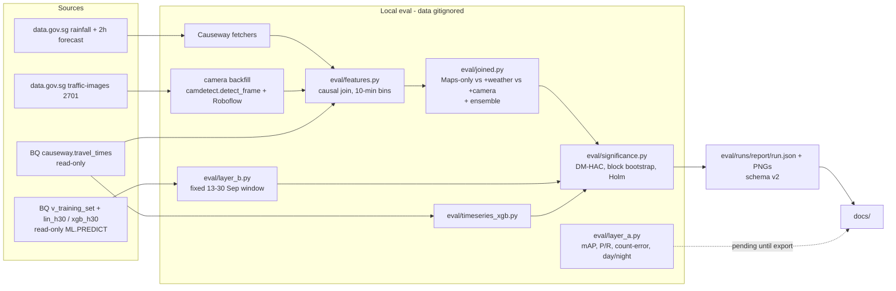

# Work plan: evaluation integrity, hardening, and joined-feature experiment

**Status:** active. **Owner:** Evaluation & Risk. **Target:** final report, 31 Oct 2026.
**Source of truth for live resources:** GCP project `swiftborder` ([inventory.md](inventory.md) is the dated copy).

This plan comes from a full-repo review against a read-only query of `swiftborder` on **2026-09-30 ~21:35 SGT**. It corrects evaluation bugs, hardens ingest and detection code, upgrades significance testing, and adds the experiments the report needs. The Status column is updated as work lands. Results enter [evaluation.md](evaluation.md) only from a promoted [`eval/runs/report/run.json`](../eval/runs/report/run.json).

## Problems found

| Area | Problem |
| --- | --- |
| Offline XGB | Persistence baseline uses `target_lag_12`. That is 115 min before the label, but it is labelled T-60. The offline "−3.67 min, significant" result is against a weakened baseline. |
| Offline XGB | `duration_sec` is taken at the target row. It comes from the same Maps call as the label, so it leaks the target. The backtest replaces it with a median constant, so training and scoring see different inputs. |
| Offline XGB | Labels are interpolated, bfilled and slew-limited before scoring. Backtest days (22–24 Sep) overlap the 80% training split, which ends ~22 Sep 12:40 SGT. XGB and LSTM use different test sets. |
| Significance | iid paired t-test; non-overlapping block bootstrap labelled "moving-block"; blocks can span directions; scipy unpinned (silent normal fallback); no multiple-comparison control. |
| Docs | `xgb_h30` "beats persistence" (CI [−0.305, +0.107]); README headline "24-hour forecast"; ≤15 min row in the claims register; test window 06:50 vs 07:00 UTC; "n=866 per direction" (866 is combined); stale "optional" harness wording; hyphenated `swiftborder-cloudbuild` (live name uses an underscore); frame-cache arrow with no writer in git; mojibake and BOM in a skill file. |
| Ingest | Causeway fetchers write partial or failed days and never refetch them. |
| Detection | `camdetect`: `confidence=0` ignored, image download not status-checked, malformed predictions crash image modes, unvalidated `date_time`, upstream errors echoed to callers. |
| Gaps | No Layer A scorer, no joined-feature experiment, no vs-Maps baseline. |

## Decisions

| Topic | Decision |
| --- | --- |
| Live `swiftbackend` security | **Document only.** No live changes. |
| BQML 30-min scoring window | **Fixed**: 2026-09-13 00:00 SGT to the latest labelled bin, both directions, pinned in `run.json`. |
| Scope | Full: eval fixes, code hardening, significance upgrades, Layer A scorer, joined experiment. |
| Joined features | **Offline** join in `eval/`. Backfill weather via Causeway fetchers and camera 2701 counts via local `camdetect` + Roboflow. |
| Roboflow budget | **Free tier only**. Pilot, measure credits, then a budgeted backfill that stops cleanly on quota. |
| Layer A | Script plus fixture tests. Result cells stay `pending` until a Roboflow export exists. |
| Testing | GitHub Actions (fast suites, Python 3.11, no deploy, no secrets) plus a local runner that includes slow TensorFlow/xgboost tests. |
| GCP | Read-only queries only. Any write needs explicit approval. |
| Git | No commit or push without approval. A push of `camdetect/main.py` or `camdetect/requirements.txt` to `main` redeploys `swiftbackend`. |

## Verified background (2026-09-30 ~21:35 SGT, read-only)

- `lin_h30` (created 2026-09-12 06:15 UTC) and `xgb_h30` (06:19 UTC) were never retrained. Both use a CUSTOM split on `is_val` (11–12 Sep). BQML internal eval MAE 3.04 / 2.87 is not harness output. **Every date from 13 Sep is out-of-sample.**
- `v_training_set`: `LEAD(bin_ts, 3)` is exactly 30 min on every row (0 exceptions of 3,572 per direction). `route_id` to `direction` is 1:1. 7,144 labelled rows, 2026-09-05 17:50 to 2026-09-30 13:00 UTC. Live `v_training_set` and `v_forecast_recent` match [sql/](../sql/).
- `causeway.travel_times`: 14,296 rows (7,148 per direction), 2026-09-05 17:53 to 2026-09-30 13:35 UTC.
- Frozen stores: `Cam2701` / `Cam2702` last modified 18 Jul; `rainfall` / `weatherforecast` 3 Sep. None overlaps `travel_times`, so the join needs a backfill. Those datasets are in `asia-southeast1`; `causeway` and `traffic_prediction` are in `US`, so a BigQuery join is not possible without copying data.
- `swiftbackend` (`europe-west1`, revision `swiftbackend-00023-f8g`, commit e49b232): IAM invoker check disabled, ingress `all`, `ALLOWED_ORIGIN` unset (CORS `*`), `ROBOFLOW_API_KEY` a plain env var, `CACHE_BUCKET` set but not read by `camdetect`. Any caller can trigger billed inference.
- Bucket names are exact in [inventory.md](inventory.md); the Cloud Build bucket is `swiftborder_cloudbuild`.
- Roboflow free tier has no overage billing. When included credits run out, calls fail until the monthly reset. The per-image hosted-inference credit cost is ambiguous in Roboflow's docs, so it is measured with a pilot. Weight download (self-hosting) is Core-only.

## Method choices

| Choice | Detail |
| --- | --- |
| Primary test | Diebold–Mariano on the absolute-error loss differential, Newey–West (Bartlett) variance, Harvey–Leybourne–Newbold small-sample correction, Student-t(n−1). HAC lag = max(h−1, ⌊4(n/100)^(2/9)⌋): h−1 covers overlapping h-step errors (2 for 30 min on 10-min bins; 11 for 60 min on 5-min bins), and the Newey–West (1994) rule covers longer dependence in traffic loss differentials. Autocovariances stay within a direction. |
| Interval | Overlapping moving-block bootstrap, default one-day blocks, never crossing a direction group. Fewer than 10 blocks per resample → decision "insufficient data". |
| Multiplicity | Holm correction of two-sided DM p-values, one family per harness family (family-wise error of directional claims ≤ α = 0.05). |
| Decision | "Better" only when the Holm-adjusted two-sided DM p < α, the mean difference has the right sign, **and** the bootstrap CI excludes 0. Paired t-test kept as a supplementary column. |
| Features | Causal only: every input is observed at or before the forecast origin. |

References: Diebold & Mariano (1995), *J. Bus. Econ. Stat.* 13(3); Harvey, Leybourne & Newbold (1997), *Int. J. Forecasting* 13(2); Künsch (1989), *Ann. Statist.* 17(3); Holm (1979), *Scand. J. Statist.* 6(2); Newey & West (1987), *Econometrica* 55(3).

## Design

One significance module and one manifest schema serve every harness. Doc result cells come only from the promoted `run.json`.

## Tasks

| # | Task | Done when | Status |
| --- | --- | --- | --- |
| 0 | Write this plan; link from the doc map and roadmap | Plan renders and is linked | done |
| 1 | Pin dependencies; `slow` pytest marker; `scripts/run_tests.*`; GitHub Actions workflow | All suites pass on Python 3.11 locally | done (workflow unverified until a branch push is approved) |
| 2 | Offline persistence = `target_lag_1`; remove target-time `duration_sec`; backtest uses the same features (TDD) | Tests prove persistence = y[t−h] and no target-time feature | done |
| 3 | Backtest days after the split; causal input filter; score raw labels; shared XGB/LSTM split | Tests prove no overlap and raw-label scoring | done |
| 4 | Significance: DM-HAC-HLN, moving/day blocks per group, Holm, decision rule | Known-answer, coverage and Holm tests pass | done |
| 5 | Run manifest v2: git SHA, data hash, windows, model metadata, per-slice results; promote validates | Invalid or dirty runs are refused | done (`--allow-dirty` override is recorded) |
| 6 | `layer_b.py` fixed window from 13 Sep; `after_gap = 0`; +30 min check; model-time assertion; slices; ensemble | Fake-client tests pass; v2 BQML run produced | done |
| 7 | Causeway fetcher hardening; weather/rainfall backfill 5–30 Sep | Mocked-session tests pass; per-day completeness report | done (5–29 Sep complete; 30 Sep fetched after it ends) |
| 8 | `camdetect` hardening; `detect_frame()` core | Handler tests pass | done (not deployed; a push to `main` would redeploy) |
| 9 | Camera 2701 count backfill (dry run, 50-call pilot, budgeted run) | Coverage report by day | script and tests done; **pilot handed off** to the Roboflow key holder: [handoff-camera-pilot.md](handoff-camera-pilot.md) |
| 10 | Causal feature builder (`eval/features.py`) | Causality and parity tests pass | done (parity with live `v_training_set` on 7,172 rows, recorded in `run.json`; camera 0% until Task 9 runs) |
| 11 | Joined-feature experiment (`eval/joined.py`), vs-Maps baseline, ensemble | ΔMAE table with CIs per feature set and direction | done (weather: no significant gain; camera pending Task 9) |
| 12 | Layer A scorer (`eval/layer_a.py`) on fixtures | Hand-computed fixture tests pass; results stay `pending` | done |
| 13 | Full re-run and promotion to `eval/runs/report/` | v2 manifest validates; artifacts exist | done (`20260930T175104Z_offline-bqml-joined`, made from committed code `15f094b`, clean tree; camera rows pending Task 9) |
| 14 | Documentation truthfulness and fresh inventory | Link and banned-string checks pass; numbers trace to `run.json` or inventory | done (deck PNGs still need regeneration) |
| 15 | Final verification and review | Full runner green; review verdict recorded | done (semantic review NEEDS_CHANGES → 10 issues fixed, re-run and re-promoted from committed code) |

### Camera backfill budget (Task 9)

1. `--dry-run` prints the call count. Default sampling covers peak hours (06:00–10:59 and 16:00–21:59 SGT) at 10-min bins first, then off-peak at 20-min bins: 2,730 calls for 5–30 Sep (dry run, 2026-09-30). `--mode full` samples every 10-min bin: 3,743.
2. Pilot `--max-calls 50` on one day, run by the team member who holds the Roboflow key ([handoff-camera-pilot.md](handoff-camera-pilot.md)). The credit change is read from the Roboflow Credit Usage page before the full run.
3. A quota or payment error (402, 403, or 429 with a quota message) stops the run and saves a checkpoint. The run resumes after the monthly credit reset.
4. Bins without a scored frame stay missing (not zero). The "+camera" model is scored only on covered bins, and coverage is reported. Below about 60% coverage of test bins, the result is marked insufficient.

## Risks

| Risk | Handling |
| --- | --- |
| Roboflow credits run out | Budgeted, resumable backfill; "+camera" row marked insufficient if coverage is thin. |
| Corrected offline numbers lose the headline "win" | Report what the harness shows. Negative results go in [findings.md](findings.md). |
| A `camdetect` fix is pushed to `main` | Push only on approval; the trigger redeploys `swiftbackend`. |
| Public `swiftbackend` is abused | Documented risk (decision above); lock-down is a separate, approved change. |
